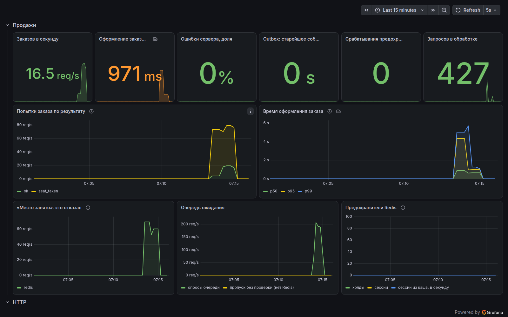

# dd — SaaS для продажи билетов

Платформа для организаторов мероприятий: организатор заводит событие и схему зала и продаёт билеты со своего сайта. Дипломный проект.

Сейчас готовы вход по одноразовому коду, кабинет организатора (площадки, схемы залов, события с ценами и обложками, публикация), публичная страница события и бронирование мест с холдом на 10 минут, оплата через платёжного провайдера (в MVP — его мок) электронные билеты с QR-кодом, бесплатные мероприятия, API контроля входа со ссылками сканера, возвраты, отмена события и отчёты организатора. Веб-интерфейс: сайт покупателя (афиша, схема зала, оформление, оплата, билеты, возвраты), кабинет организатора (площадки, конструктор схемы зала, события, цены, обложки, публикация, продажи, ссылки для контролёров) и сканер контролёра с камерой и работой без сети. Нагрузочный эксперимент со стратегиями захвата мест проведён (ADR 017): двойных броней нет ни в одном из 60 прогонов, в продукте — Redis + БД с предохранителем.

- Правила работы и стек — [`CLAUDE.md`](CLAUDE.md)
- Спецификация — [`docs/spec.md`](docs/spec.md)
- Архитектурные решения — [`docs/adr/`](docs/adr/)

## Что нужно установить

| Инструмент | Версия | Зачем |
|---|---|---|
| Docker с Compose v2 | Docker 24+, Compose 2.24+ | инфраструктура и запуск проекта |
| Go | 1.27.1 | локальная разработка; с Go 1.21+ нужная версия скачается сама по `go.mod` |
| Node.js | 22.12+ (в CI и Docker — 24) | разработка фронтенда в `web/` |
| make | любая | команды разработки |

Для одного только запуска в Docker Go, Node.js и make не нужны.

## Быстрый старт: весь проект в Docker

```sh
git clone https://github.com/funster-a/dd.git
cd dd
docker compose up -d --build --wait
```

Команда собирает образы и поднимает PostgreSQL, Redis, RabbitMQ, SeaweedFS, Prometheus, Grafana и мок платёжного провайдера. Затем применяет миграции и запускает api, worker и сайт. Она завершается, когда все сервисы здоровы.

Сайт покупателя открывается на http://localhost:8000, кабинет организатора — на http://localhost:8000/org. Коды входа в разработке не отправляются, а пишутся в лог api: `docker compose logs api | grep one-time`.

Первого организатора заводит администратор платформы (интерфейса админки нет, только API):

```sh
echo 'ADMIN_EMAILS=admin@example.com' >> .env && docker compose up -d api
# вход администратора и создание организатора — раздел API ниже
```

Дальше владелец входит в кабинет по своему email и проходит путь целиком: площадка → схема зала → событие → цены → обложка → публикация. В разделе «Контроль входа» опубликованного события создаётся ссылка сканера: её QR открывается камерой телефона контролёра.

Проверка:

```sh
curl http://localhost:8080/healthz   # {"status":"ok"}
curl http://localhost:8080/readyz    # {"checks":{"postgres":"ok","redis":"ok","storage":"ok"},"status":"ok"}
```

Отправить сообщение в тестовую очередь worker и увидеть его в логе:

```sh
curl -u dd:dd -H 'content-type: application/json' \
  -X POST http://localhost:15672/api/exchanges/%2F/amq.default/publish \
  -d '{"routing_key":"dd.test","payload":"hello","payload_encoding":"string"}'
docker compose logs worker
```

Остановить: `docker compose down`. Удалить вместе с данными: `docker compose down -v`.

### Несколько экземпляров api и воркера

По умолчанию поднимаются два экземпляра api и два воркера (ADR 023). Порт 8080 слушает балансировщик `api-lb` (nginx): он раскладывает запросы по экземплярам api, а сайт ходит в api тоже через DNS-имя сервиса. Число экземпляров меняется без перезапуска остальных:

```sh
docker compose up -d --scale api=4 --scale worker=3 --no-recreate
```

То же постоянно — `API_REPLICAS` и `WORKER_REPLICAS` в `.env`. Новые экземпляры балансировщик и Prometheus находят через DNS Docker за 10 секунд.

### Адреса

| Сервис | Адрес | Доступ |
|---|---|---|
| Сайт покупателя | http://localhost:8000 | вход по телефону, код в логе api |
| Кабинет организатора | http://localhost:8000/org | вход по email, код в логе api |
| Сканер контролёра | http://localhost:8000/scan#… | ссылка из кабинета, раздел «Контроль входа» |
| api (через балансировщик `api-lb`) | http://localhost:8080 | — |
| RabbitMQ, панель управления | http://localhost:15672 | `dd` / `dd` |
| Prometheus | http://localhost:9090 | — |
| Grafana | http://localhost:3000 | `admin` / `admin`, дашборд «Партер: продажи и система» в папке «Партер» |
| Мок платёжного провайдера | http://localhost:8090 | страница оплаты, карта не нужна |
| S3 (SeaweedFS) | http://localhost:8333 | `dd` / `dd-secret-key`, бакет `dd-media` открыт на чтение |
| PostgreSQL | `localhost:5432` | `dd` / `dd`, база `dd` |
| Redis | `localhost:6379` | без пароля |

Все порты открыты только на `127.0.0.1`. Порты и пароли меняются через `.env`: скопируйте `.env.example` в `.env` и поправьте нужное. Его читают и docker compose, и Makefile.

- **Порты** можно менять когда угодно.
- **Логины, пароли и имя базы** PostgreSQL, RabbitMQ и Grafana образы применяют только при первом создании volume. После их смены выполните `docker compose down -v` — это удалит локальные данные.
- **Пароли подставляются в строки подключения как есть**, поэтому используйте только буквы, цифры и `-`, `_`, `.`, `~`. Makefile читает `.env` по правилам make: без кавычек, без комментариев в конце строки и без `$` и `#` в значениях.

## Локальная разработка

Инфраструктура работает в Docker, api и worker запускаются через `go run`. Так быстрее пересобирать и можно подключить отладчик.

```sh
make infra-up        # только PostgreSQL, Redis, RabbitMQ, SeaweedFS, Prometheus, Grafana
make migrate-up      # применить миграции
make run             # api на :8080
make run-worker      # worker, в другом терминале
make run-fakepsp     # мок платёжного провайдера на :8090, в третьем терминале
```

Если api из Docker уже запущен, он занимает порт 8080. Остановите его (`docker compose stop api`) или запустите локальный на другом порту: `make run HTTP_ADDR=:8081`.

Сайт в режиме разработки: Vite с горячей перезагрузкой проксирует `/v1` в api на `:8080` (другой адрес — `API_URL=http://localhost:8081 npm run dev`):

```sh
cd web
npm ci
npm run dev          # http://localhost:5173
npm test             # юнит-тесты (vitest)
npm run typecheck    # vue-tsc
```

Чтобы ссылки на билеты и возврат после оплаты вели на Vite, запустите api и worker с `PUBLIC_BASE_URL=http://localhost:5173`.

Разовые переопределения передавайте аргументом make (`make run LOG_LEVEL=debug`), а не префиксом перед командой. Значения из `.env` для make сильнее переменных окружения.

### Команды

`make help` выводит полный список.

| Команда | Что делает |
|---|---|
| `make up` / `make down` | поднять или остановить весь проект в Docker |
| `make infra-up` | поднять только инфраструктуру |
| `make run` / `make run-worker` / `make run-fakepsp` | запустить api, worker или мок платёжного провайдера локально |
| `make build` | собрать бинари в `bin/` |
| `make test` | юнит-тесты с детектором гонок |
| `make test-integration` | все тесты, включая интеграционные с PostgreSQL и RabbitMQ (нужен `make infra-up`) |
| `make lint` | golangci-lint той же версии, что в CI |
| `make sqlc` | сгенерировать Go-код запросов из `queries.sql` |
| `make migrate-up` | применить все новые миграции |
| `make migrate-down` | откатить последнюю миграцию |
| `make migrate-reset` | откатить все миграции |
| `make migrate-status` | статус миграций |
| `make migrate-create name=add_events` | создать новую миграцию |

`make test` и `make test-integration` запускаются с `-race`. На Linux детектору гонок нужен C-компилятор (gcc), на macOS — не нужен.

### Переменные окружения api и worker

| Переменная | По умолчанию | Назначение |
|---|---|---|
| `HTTP_ADDR` | `:8080` | адрес HTTP-сервера api |
| `LOG_LEVEL` | `info` | `debug`, `info`, `warn`, `error` |
| `SHUTDOWN_TIMEOUT` | `15s` | общий бюджет корректной остановки |
| `DATABASE_URL` | `postgres://dd:dd@localhost:5432/dd?sslmode=disable` | PostgreSQL |
| `REDIS_ADDR` | `localhost:6379` | Redis |
| `REDIS_SENTINELS`, `REDIS_MASTER` | пусто, `dd` | адреса Sentinel через запятую и имя группы: если заданы, ведущий Redis ищется через Sentinel, `REDIS_ADDR` не используется (ADR 029) |
| `RABBITMQ_URL` | `amqp://dd:dd@localhost:5672/` | RabbitMQ; узлы кластера — несколько адресов через запятую (ADR 030) |
| `PUBLIC_BASE_URL` | `http://localhost:8080` | адрес сайта для браузера: ссылки на билеты, возврат после оплаты. В Docker — адрес сайта `http://localhost:8000` |
| `PSP_URL` | `http://localhost:8090` | API платёжного провайдера (мок `fakepsp`) |
| `PSP_API_KEY`, `PSP_WEBHOOK_SECRET` | `dev-psp-api-key`, `dev-psp-webhook-secret` | ключ API и секрет подписи вебхуков; значения только для мока |
| `PAYMENT_CALLBACK_URL` | `PUBLIC_BASE_URL` + `/v1/payments/webhooks/fakepsp` | куда провайдер шлёт вебхуки |
| `TICKET_SIGNING_KEY` | ключ для разработки | секрет подписи ссылок на билеты, от 16 символов |
| `QUEUE_PREFIX` | `dd.` | префикс очередей событий между модулями |
| `BOOKING_STRATEGY` | `redis` | стратегия захвата мест: `redis`, `pessimistic`, `optimistic` (ADR 017) |
| `SERVICE_FEE_BPS` | `500` | сервисный сбор с покупателя в сотых долях процента, 500 = 5 % (ADR 019) |
| `METRICS_ADDR` | `:9091` | адрес `/metrics` воркера (ADR 022) |
| `QUEUE_ADMIT_PER_SECOND` | `50` | очередь ожидания при старте продаж: сколько покупателей в секунду пропускать, `0` — без очереди (ADR 020) |
| `AVAILABILITY_SUMMARY_TTL` | `1s` | сколько экземпляр api отдаёт сводку занятости по секторам (план стадиона) из памяти, `0` — без кэша (ADR 026) |
| `IP_TICKET_LIMIT` | `40` | билетов на событие с одного IP-адреса, `0` — без лимита (ADR 020) |
| `TRUSTED_PROXIES` | loopback и частные сети | сети обратных прокси, которым api верит в `X-Forwarded-For` (ADR 020) |

Значения по умолчанию совпадают с `docker-compose.yml`. Все переменные проверяются при старте. Неверное значение, например `LOG_LEVEL=loud` или `REDIS_ADDR=redis` без порта, останавливает процесс с понятной ошибкой. Пароли в текст ошибок не попадают.

## API

Все эндпоинты — под `/v1`, ошибки в формате `{"error": {"code": "...", "message": "..."}}` (ADR 007). Вход без паролей, по одноразовому коду (ADR 006). В разработке код не отправляется, а пишется в лог api.

Вход покупателя:

```sh
curl -X POST localhost:8080/v1/auth/codes -d '{"kind":"buyer","phone":"+77001234567"}'
docker compose logs api | grep one-time    # код из лога
curl -X POST localhost:8080/v1/auth/sessions -d '{"kind":"buyer","phone":"+77001234567","code":"123456"}'
curl localhost:8080/v1/me -H "Authorization: Bearer <token>"
curl -X DELETE localhost:8080/v1/auth/session -H "Authorization: Bearer <token>"
```

Организатор входит так же, но с `"kind":"organizer","email":"..."`, администратор платформы — с `"kind":"admin"`. Его email должен быть в `ADMIN_EMAILS`.

Администратор заводит организатора. После этого владелец может войти по своему email:

```sh
curl -X POST localhost:8080/v1/admin/organizers \
  -H "Authorization: Bearer <admin-token>" -H "Idempotency-Key: $(uuidgen)" \
  -d '{"name":"Stand-up Club","slug":"standup-club","owner_email":"owner@example.com"}'
```

Кабинет организатора (`/v1/organizer`, организатор берётся из сессии и видит только свои данные):

| Метод и путь | Что делает |
|---|---|
| `GET /profile` | название и slug организатора для публичных ссылок |
| `GET/POST /venues`, `GET/PUT /venues/{id}` | площадки: название, адрес, часовой пояс, координаты |
| `GET/POST /venues/{id}/seat-maps`, `GET /seat-maps/{id}` | схемы залов |
| `GET /seat-map-templates`, `GET /seat-map-templates/{id}` | готовые схемы площадок, например Центральный стадион Алматы (ADR 024) |
| `GET/POST /events`, `GET/PUT /events/{id}` | события (черновик меняется целиком) |
| `GET/PUT /events/{id}/prices` | ценовые категории: сектора целиком и диапазоны рядов `rows` (ADR 025) |
| `POST /events/{id}/media/uploads`, `PUT /events/{id}/media` | ссылка на загрузку обложки и её прикрепление |
| `POST /events/{id}/publish` | публикация: проверка готовности и генерация мест |
| `GET/POST /events/{id}/scanners`, `DELETE /scanners/{id}` | ссылки сканера для контролёров на входе |
| `POST /events/{id}/cancel` | отмена события: всем покупателям деньги возвращаются полностью |
| `GET /events/{id}/report`, `GET /events/{id}/report/tickets.csv` | продажи, заполняемость, выручка; список билетов для Excel |

Событие со свободным входом создаётся с `"admission": "free_entry"` без `seat_map_id`. У него нет билетов и цен, публикуется только страница. Бесплатные билеты — категория с `price_tiyn: 0`: такой заказ оформляется сразу, без оплаты.

Схема зала — это сектора с рядами и местами и входные зоны с вместимостью:

```json
{"name": "Open air", "layout": {"sections": [
  {"name": "Фан-зона", "kind": "general", "capacity": 1500},
  {"name": "VIP", "kind": "seat", "rows": [{"label": "1", "seats": [{"label": "1", "x": 10, "y": 20}]}]}
]}}
```

Публичная страница события — без входа, только опубликованные события:

```sh
curl localhost:8080/v1/public/events       # афиша: ближайшие опубликованные события с минимальной ценой
curl localhost:8080/v1/public/events/standup-club/<event-slug>
```

В ответе карточка, площадка, обложки, цены и схема зала. Ответ кэшируется в Redis на 10 минут. Одновременные промахи кэша идут в базу одним запросом. Смена обложки сбрасывает кэш сразу.

Покупка (ADR 011). Id события берётся из публичной страницы, места указываются позицией на схеме зала, во входной зоне — количеством:

```sh
curl localhost:8080/v1/events/<event-id>/availability     # занятые места, свободные по секторам и во входных зонах, окно очереди
curl 'localhost:8080/v1/events/<event-id>/availability?view=summary'          # только сводка по секторам (план стадиона, ADR 024)
curl 'localhost:8080/v1/events/<event-id>/availability?section=Сектор%2033'   # занятые места одного сектора
curl -X POST localhost:8080/v1/events/<event-id>/orders \
  -H "Authorization: Bearer <buyer-token>" -H "Idempotency-Key: $(uuidgen)" \
  -d '{"seats":[{"section":"Партер","row":"1","seat":"3"}],"general":[{"section":"Фан-зона","quantity":2}],"email":"me@example.com"}'
curl localhost:8080/v1/orders/<order-id> -H "Authorization: Bearer <buyer-token>"
curl localhost:8080/v1/me/orders -H "Authorization: Bearer <buyer-token>"      # заказы покупателя для «Моих билетов»
curl -X POST localhost:8080/v1/orders/<order-id>/cancel \
  -H "Authorization: Bearer <buyer-token>" -H "Idempotency-Key: $(uuidgen)"
curl -X POST localhost:8080/v1/events/<event-id>/queue \
  -H "Authorization: Bearer <buyer-token>"                  # очередь ожидания: место и когда спросить снова
```

Очередь ожидания (ADR 020) включает организатор в карточке события (`waiting_room`, нужен старт продаж): встать в неё можно за 15 минут до старта, действует она 2 часа после. Всем, кто встал до старта, порядок определяет жребий, остальные — в порядке прихода. После старта очередь пропускает `QUEUE_ADMIT_PER_SECOND` покупателей в секунду, заказ без своей очереди — `422 queue_required`. Без Redis очередь пропускает всех. С одного IP-адреса на событие берётся не больше `IP_TICKET_LIMIT` билетов — `422 ip_ticket_limit_exceeded`.

Места держатся за заказом 10 минут. Потом worker переводит заказ в `expired`, а места снова продаются. Новый заказ покупателя на то же событие заменяет прежнюю корзину. В заказе не больше мест, чем лимит билетов на покупателя в карточке события. Если место занято, ответ — `409 seat_taken`. Если во входной зоне не хватает мест — `409 not_enough_seats`.

Оплата и билеты (ADR 012). Карту покупатель вводит только на странице провайдера, платформа карточных данных не видит. В MVP провайдер — мок `fakepsp`: отдельный сервис со своей страницей оплаты и подписанными вебхуками.

```sh
curl -X POST localhost:8080/v1/orders/<order-id>/payments \
  -H "Authorization: Bearer <buyer-token>" -H "Idempotency-Key: $(uuidgen)"
# → {"payment_url": "http://localhost:8090/pay/pay_..."} — открыть в браузере и нажать «Оплатить»
curl localhost:8080/v1/orders/<order-id>/tickets -H "Authorization: Bearer <buyer-token>"
# → ссылки на билеты http://localhost:8080/t/<token>: страница с QR-кодом
```

После оплаты провайдер возвращает покупателя на `/payment/return`, а платформе присылает вебхук. Дальше события идут через outbox и RabbitMQ:
1. booking помечает заказ оплаченным;
2. ticket выпускает билеты и пишет письмо со ссылками в лог worker.

Если оплата пришла после конца холда, заказ не восстанавливается, и деньги автоматически возвращаются.

Возврат билетов покупателем (ADR 014):

```sh
curl -X POST localhost:8080/v1/orders/<order-id>/refunds \
  -H "Authorization: Bearer <buyer-token>" -H "Idempotency-Key: $(uuidgen)" -d '{"ticket_ids":["<ticket-id>"]}'
```

Как работает возврат:
- возврат принимается не позже срока, заданного организатором (по умолчанию за 24 часа до начала);
- билеты аннулируются сразу, деньги возвращает платёжный провайдер;
- место снова появляется в продаже;
- заказ становится `partially_refunded` или `refunded` после успешного возврата денег.

Контроль входа (ADR 013). Организатор создаёт ссылку сканера и отдаёт её контролёру. Токен из ссылки передаётся в заголовке:

```sh
curl localhost:8080/v1/scanner/manifest -H "Authorization: Scanner <token>"   # билеты события для работы без сети
curl -X POST localhost:8080/v1/scanner/scans -H "Authorization: Scanner <token>" \
  -d '{"device_id":"вход-а","scans":[{"client_scan_id":"1","code":"http://localhost:8080/t/<token>"}]}'
# → accepted | duplicate | revoked | invalid | wrong_event
```

Правила засчитывания прохода:
- онлайн проходит первое обработанное сканирование, остальные получают «уже прошёл»;
- после работы без сети сканер отправляет накопленное с `"offline": true` и временем сканирования, и засчитывается самое раннее сканирование.

Все изменяющие запросы, кроме входа, требуют заголовок `Idempotency-Key`. Повтор с тем же ключом возвращает прежний ответ и ничего не создаёт заново (ADR 008).

## Как устроено

```
cmd/api/          HTTP-сервер: chi, /healthz, /readyz, graceful shutdown
cmd/worker/       события между модулями (outbox → RabbitMQ), закрытие просроченных заказов
cmd/fakepsp/      мок платёжного провайдера: страница оплаты, вебхуки, возвраты
internal/catalog/ организаторы, площадки, схемы залов, события, публичная страница
internal/booking/ холды мест, заказы, занятость мест
internal/payment/ оплата через провайдера, вебхуки, возвраты
internal/ticket/  выпуск билетов, ссылки с подписью, QR, контроль входа
internal/identity/ вход по одноразовому коду, сессии
internal/platform/ общий код: config, db, redis, mq, outbox, events, httpx, observability, storage
internal/fakepsp/ логика мока провайдера (для cmd/fakepsp и тестов)
migrations/       goose-миграции
docs/             спецификация и ADR
web/              сайт покупателя, кабинет организатора (/org) и сканер (/scan): Vue, TypeScript, Vite; в Docker — nginx (ADR 015, 016)
loadtest/         нагрузочный эксперимент: сценарий k6 и скрипты прогона (ADR 017)
cmd/loadseed/     подготовка данных эксперимента, проверка инварианта, отчёт
```

- **Логи** пишутся в JSON через `log/slog`. У каждой строки есть поле `service`, у строк запроса — `request_id` (заголовок `X-Request-ID`).
- **`/healthz`** отвечает 200, пока процесс жив. **`/readyz`** проверяет PostgreSQL, Redis и хранилище файлов. Без PostgreSQL — 503; отказ Redis или хранилища — 200 со статусом `degraded`: api без них работает (ADR 003, ADR 030).
- **Границы модулей** проверяет линтер: доменные модули не импортируют друг друга, `platform` не зависит от доменных модулей. Подробности — в ADR 004.

## Наблюдаемость

Метрики, дашборд и алерты — ADR 022.

- **api** отдаёт `/metrics` на своём порту: HTTP по маршрутам (`dd_http_*`), бронирование и очередь (`dd_booking_*`), сессии (`dd_identity_*`).
- **worker** отдаёт `/metrics` на `METRICS_ADDR` (`:9091`): обработка очередей (`dd_mq_*`), отставание outbox (`dd_outbox_*`), истёкшие заказы.
- **PostgreSQL и Redis** — через экспортёры в Compose, **RabbitMQ** — встроенным плагином.
- **Дашборд** Grafana «Партер: продажи и система» (`deploy/grafana/dashboards/dd-overview.json`): продажи и очередь, HTTP, воркер, хранилища и процессы. Дашборд правится в JSON и проходит ревью, правки в интерфейсе при перезапуске не сохраняются.
- **Алерты** — `deploy/prometheus/alerts.yml`, видны в Prometheus (Alerts) и в Grafana: недоступная цель, ошибки сервера, медленное оформление заказа, вставший outbox, сообщения в очереди недоставленных, отказ Redis, очередь без проверки.

api и worker, запущенные на машине через `make run` и `make run-worker` (и нагрузочные эксперименты), Prometheus тоже собирает: задания `api-local` и `worker-local`. Поэтому прогон k6 виден на дашборде сразу.



## Тесты и CI

GitHub Actions ([`.github/workflows/ci.yml`](.github/workflows/ci.yml)) запускается на каждый push и выполняет:

- **Build** — `go mod tidy -diff`, сборка;
- **Lint** — golangci-lint v2.14.0;
- **Test** — миграции против PostgreSQL: `up`, `reset` с проверкой, что в базе ничего не осталось, снова `up`; затем все тесты с `-race`, включая тесты инвариантов схемы и интеграционные с RabbitMQ;
- **Web** — `npm ci`, проверка типов `vue-tsc`, юнит-тесты vitest, сборка Vite;
- **Compose** — `docker compose up --build --wait` с нуля, проверка api, доставки сообщения до worker, раздачи сайта, прокси `/v1` и заголовка CSP.

Интеграционные тесты запускаются, только если заданы переменные `DATABASE_TEST_URL` (PostgreSQL), `REDIS_TEST_ADDR`, `RABBITMQ_TEST_URL` и `S3_TEST_ENDPOINT`, иначе пропускаются. `make test-integration` задаёт их сама. Тесты базы создают для себя временную базу `dd_test_*`, применяют к ней миграции и удаляют её после теста, поэтому рабочая база не засоряется.

Главный инвариант — место не продаётся дважды — проверяется на двух уровнях:

- **схема:** 50 транзакций одновременно выпускают билет на одно место, и выпуск удаётся ровно у одной (`migrations/schema_test.go`);
- **бронирование:** 200 покупателей одновременно берут одно место, покупатели берут пересекающиеся наборы мест, входная зона продаётся сверх вместимости. Каждый сценарий проходит и с Redis, и без него (`internal/booking/orders_test.go`).

## Нагрузочный эксперимент

Сравнение трёх стратегий захвата места при конкурентном доступе (spec.md, «Инженерное ядро»; ADR 017). Результаты, таблицы и графики — в [`docs/experiments/2026-10-booking-strategies`](docs/experiments/2026-10-booking-strategies/).

Стратегия выбирается переменной `BOOKING_STRATEGY` у api:
- `redis` — по умолчанию, продуктовая;
- `pessimistic` и `optimistic` — только для эксперимента.

Повторить серию (нужны `make infra-up`, `make migrate-up` и Docker — k6 запускается образом `grafana/k6`):

```sh
./loadtest/run.sh                                   # 3 стратегии × 500/2000/5000 × 3 повтора × 2 сценария
STRATEGIES=redis LEVELS=500 REPEATS=1 ./loadtest/run.sh   # быстрый прогон
./loadtest/redis-failure.sh                         # отказ Redis в середине прогона
./loadtest/queue.sh                                 # очередь ожидания при старте продаж (ADR 020)
./loadtest/scale.sh                                 # ёмкость при 1, 2, 4 экземплярах api (ADR 023)
./loadtest/storm.sh                                 # штурм стадиона: концерт, 5000 покупателей, с очередью и без (ADR 026)
./loadtest/chaos.sh                                 # отказ экземпляра api посреди продажи: kill и stop (ADR 027)
go run ./cmd/loadseed chaos-report -series "после=loadtest/results/raw/chaos" -out docs/experiments/<папка>
./loadtest/pgchaos.sh                               # переключение PostgreSQL посреди продажи: кластер repmgr из deploy/ha (ADR 028)
go run ./cmd/loadseed pgchaos-report -in loadtest/results/raw/pgchaos -out docs/experiments/<папка>
./loadtest/redischaos.sh                            # отказ Redis посреди продажи: один узел без журнала и с ним, Sentinel (ADR 029)
go run ./cmd/loadseed redischaos-report -in loadtest/results/raw/redischaos -out docs/experiments/<папка>
./loadtest/mqchaos.sh                               # отказ RabbitMQ посреди продажи: один узел и кластер из трёх (ADR 030)
go run ./cmd/loadseed mqchaos-report -in loadtest/results/raw/mqchaos -out docs/experiments/<папка>
go run ./cmd/loadseed storm-report -dir loadtest/results/raw/storm -out docs/experiments/<папка>
go run ./cmd/loadseed scale-report -dir loadtest/results/raw/scale -out docs/experiments/<папка>
go run ./cmd/loadseed queue-report -dir loadtest/results/raw/queue -out docs/experiments/<папка>
go run ./cmd/loadseed report -dir loadtest/results/raw/<серия> -out docs/experiments/<папка>
```

Что делает серия:
- перед каждым прогоном создаётся свежее событие с залом на 1000 мест; покупатели с сессиями создаются один раз на всю серию;
- после прогона `loadseed check` проверяет инвариант по данным: ни одно место не попало в два заказа;
- сырые данные лежат в `loadtest/results/raw/`, их нет в git; `loadseed report` собирает из них CSV, таблицы и графики.

## Если что-то не работает

- **`docker compose up` падает с `429 Too Many Requests`.** Это лимит анонимных скачиваний Docker Hub. Выполните `docker login` или подождите.
- **Порт уже занят.** Поменяйте соответствующий `*_PORT` в `.env`.
- **Сканер на телефоне не включает камеру.** Браузеры дают камеру только по HTTPS (и на `localhost`). Адрес вида `http://192.168.…` камеру не получит, но ручной ввод кода работает. Для проверки с телефона откройте сайт через HTTPS-туннель и укажите его адрес в `PUBLIC_BASE_URL`: из него собираются ссылки сканера и билетов.
- **`/readyz` отвечает 503.** Лог api (`docker compose logs api`) показывает, какая зависимость недоступна и почему.
