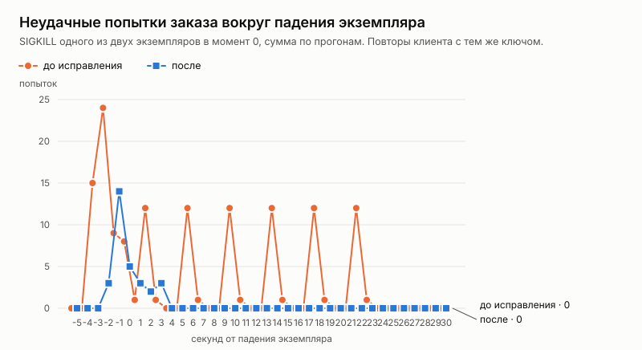

# Эксперимент: отказ экземпляра api посреди продажи

Дата: 2026-10-05. Решение по итогам — [ADR 027](../../adr/027-api-instance-failure.md).

## Вопрос

Этап 4 плана развития (spec.md) — отказоустойчивость. Первый вопрос: что видит покупатель, если один из экземпляров api пропадает посреди продажи? Два случая:
- **падение** — процесс убит, узел пропал (SIGKILL): запросы в работе обрываются на полуслове;
- **остановка** — выкатка новой версии (SIGTERM): экземпляр перестаёт принимать запросы и дорабатывает начатые.

Что важно:
- сколько покупателей останется без билета;
- сколько займёт восстановление;
- не выполнится ли один запрос дважды;
- не продастся ли место дважды.

## Как мерили

Сценарий k6 `loadtest/chaos.js`, серия `loadtest/chaos.sh`:
- **Стенд.** Два экземпляра api за nginx с той же настройкой, что `api-lb` в Compose (ADR 023): повтор на другой экземпляр — только если соединение не установилось.
- **Поток.** 200 заказов в секунду в течение 60 секунд, событие на 10 000 мест.
- **Свой покупатель на каждый заказ.** Поэтому «у покупателя два заказа» после прогона означает, что один запрос выполнился дважды.
- **Клиент как сайт.** При обрыве, 502/503/504 и «запрос ещё выполняется» он повторяет тот же запрос с тем же ключом идемпотентности: пауза 0,25 с, затем вдвое больше, не дольше 4 с, до 10 попыток — около 30 секунд.
- **Сценарий отказа.** На 20-й секунде экземпляр 1 убивают (`docker kill`) или останавливают (`docker stop`), на 40-й поднимают снова.
- **Варианты:** без отказа, падение, остановка. По три прогона на вариант.
- **Две серии.** Одна — со сборкой до исправления (код из main), другая — с исправлением ADR 027. Стенд и база одни и те же.
- **Проверки после каждого прогона:**
  - инвариант (`loadseed check`) — ни одно место не продано дважды;
  - число покупателей с двумя заказами.

Данные по каждому прогону — [`results.csv`](results.csv), таблицы — [`tables.md`](tables.md).

## Результаты

Сумма по трём прогонам каждого варианта, около 36 тысяч заказов на вариант:

| Серия | Вариант | Неудачных попыток | Из них обрыв (502) | Удалось после повторов | Ушли без билета | Восстановление | Двойных выполнений | Двойных броней |
|---|---|---:|---:|---:|---:|---:|---:|---:|
| До исправления | Без отказа | 0 | 0 | — | 0 | — | 0 | 0 |
| До исправления | Падение (SIGKILL) | 135 | 18 | 2 | **13** | — | 0 | 0 |
| До исправления | Остановка (SIGTERM) | 1 | 1 | 1 | 0 | мгновенно | 0 | 0 |
| После | Без отказа | 0 | 0 | — | 0 | — | 0 | 0 |
| После | Падение (SIGKILL) | 30 | 10 | 6 | **0** | до 8 с | 0 | 0 |
| После | Остановка (SIGTERM) | 1 | 1 | 0 | 0 | — | 0 | 0 |

После остановки в серии «после» единственный оборванный запрос при повторе получил «место занято»: место за это время купил другой покупатель.

## Разбор

**Падение экземпляра обрывает только запросы, которые были в нём в эту секунду.**
- При 200 заказах в секунду это 1–5 запросов на одно падение, в одном прогоне из шести — 15.
- Новые запросы nginx сразу отправляет на живой экземпляр: соединение с упавшим не устанавливается, и балансировщик идёт к следующему.
- Через 20 секунд упавший экземпляр поднимается и снова получает свою долю.

**До исправления 13 из 18 оборванных покупателей ушли без билета** (ещё трое при повторе получили «место занято», двое купили). Причина — устройство идемпотентности:
- Ключ занимается отдельной транзакцией до самого запроса и отмечается выполненным после.
- Экземпляр упал между этими моментами — ключ остался «выполняется».
- Повтор клиента с тем же ключом получал `409 request_in_progress`, пока ключ не признавался брошенным по времени — через минуту.
- Клиент повторяет около 30 секунд, поэтому все, чей ключ остался «выполняется», сдались раньше.
- На графике это пики каждые 4 секунды — на 2, 6, 10, 14, 18 и 22-й секундах после падения: повторы, которые упираются в чужой незавершённый ключ. На 22-й секунде идёт десятая, последняя попытка клиента, дальше пиков нет.

**После исправления без билета не ушёл никто.**
- Ключ хранит своего владельца — экземпляр, который его занял. Каждый экземпляр раз в секунду отмечается в `api_instances` (ADR 027).
- Если владелец не отмечался 5 секунд, повтор клиента снимает его ключ и выполняет запрос заново.
- Все оборванные запросы прошли не позже чем через 8 секунд: 5 секунд до признания экземпляра упавшим плюс пауза между повторами клиента.

**Остановка (выкатка) почти не заметна.**
- Экземпляр перестаёт принимать соединения и дорабатывает начатые запросы. Свои ключи он снимает с учёта, удаляя отметку из `api_instances`.
- За три прогона на каждую серию — по одному 502. Это запрос, который nginx отправил по уже открытому keepalive-соединению в момент его закрытия; повтор клиента его закрыл.

**Корректность не зависит от отказов.**
- Двойных броней — ноль во всех 18 прогонах.
- Двойных выполнений тоже ноль: ни у одного покупателя не оказалось двух заказов.
- Повторное выполнение после падения безопасно по построению: транзакция упавшего экземпляра откатилась вместе с его соединением с базой.

## Ограничения

- **Один узел.** Экземпляры — процессы на одной машине; «падение узла» смоделировано убийством процесса. Сетевого разделения, когда экземпляр жив, но не видит базу, здесь нет. Этот случай разобран в ADR 027.
- **Клиент — скрипт.** Сайт повторяет запросы так же, но живой покупатель может закрыть вкладку раньше 8 секунд.
- **Окно двойного выполнения не измерено.** Экземпляр мог упасть после фиксации заказа, но до отметки ключа выполненным; тогда повтор выполнит запрос второй раз. В 18 прогонах второго выполнения не было ни разу. Само падение в этом окне случилось только в третьем прогоне падения серии «до»: в базе 7 015 заказов при 7 011 подтверждённых клиенту, четыре заказа зафиксированы, а их ключи остались «выполняется», и повторы до конца получали 409. В серии «после» заказов в базе столько же, сколько подтверждено, во всех прогонах. Последствия разобраны в ADR 027.
