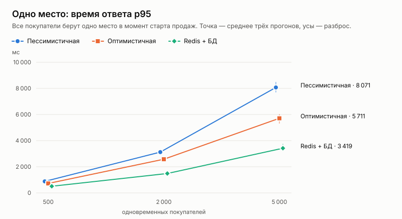
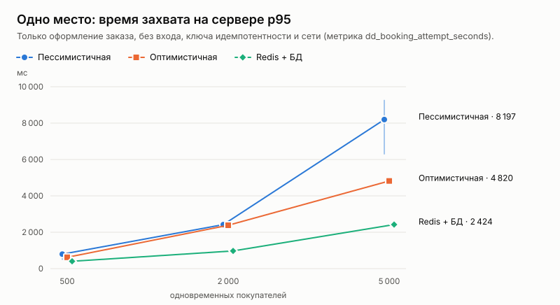
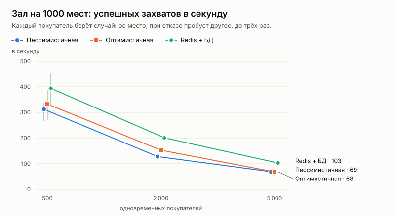
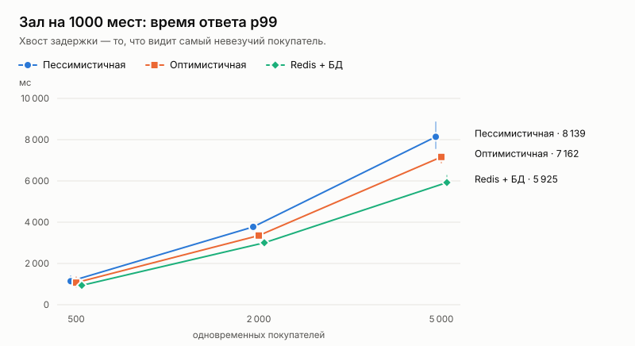

# Эксперимент: стратегии захвата места при конкурентном доступе

Дата: 2026-10-01. Решение по итогам — ADR 017.

## Вопрос

Как захватывать место, чтобы оно не продалось дважды ни при какой конкурентности (CLAUDE.md, правило 1) и при этом покупатели в момент старта продаж получали быстрый ответ? Сравниваются три стратегии из spec.md («Инженерное ядро»):

| Стратегия | Механизм | Гипотеза из spec.md |
|---|---|---|
| Пессимистичная | `SELECT … FOR UPDATE` по строкам мест, затем условный `UPDATE` | корректно, но растёт ожидание, база — узкое место |
| Оптимистичная | чтение без блокировки с версией строки, `UPDATE … WHERE version = $v`, повтор при конфликте (до 4 попыток) | быстрее на низкой конкуренции, много откатов на высокой |
| Redis + БД | атомарный захват ключа места в Redis (Lua, TTL), затем условный `UPDATE` под блокировкой строки | стабильная задержка, но нужен разбор рассинхрона с базой |

Третья стратегия — продуктовая (ADR 011). В ней Redis только отсекает проигравших до базы, а истина о брони остаётся в PostgreSQL. Поэтому рассинхрона с базой, о котором говорит гипотеза, в ней по построению нет.

## Как мерили

**Сценарии k6** (`loadtest/booking.js`). Все виртуальные покупатели ждут общий момент старта и шлют запросы одновременно.
- **one-seat** — N покупателей берут одно и то же место. Должен победить ровно один.
- **hall** — N покупателей штурмуют зал на 1000 мест (25 рядов × 40). Каждый берёт случайное место, при отказе пробует другое, до трёх раз. Меряет, сколько мест продаётся в секунду.

**Сетка:** 3 стратегии × 500 / 2000 / 5000 покупателей × 3 повтора × 2 сценария = 54 прогона. Перед каждым прогоном — свежее событие. Покупатели — 5000 настоящих сессий, созданных кодом модуля identity.

**Что записывали:**
- со стороны клиента (k6): победы, отказы 409, ошибки, время ответа p50 / p95 / p99, момент последней победы;
- со стороны сервера (`/metrics`): попытки по результату и по тому, кто отказал (Redis или база), повторы оптимистичной стратегии, гистограмма времени оформления заказа;
- после прогона `loadseed check` проверял инвариант по данным: ни одно место не входит в два активных заказа, каждая позиция заказа держится именно этим заказом, число занятых мест равно числу позиций.

**Метрики:**
- *Время ответа* — от отправки запроса до ответа, глазами покупателя. Включает вход по сессии, ключ идемпотентности и общий путь заказа.
- *Захват на сервере* — только `CreateOrder`, по гистограмме `dd_booking_attempt_seconds`. Квантиль считается линейной интерполяцией внутри корзины, как `histogram_quantile` в Prometheus. На больших значениях корзины широкие (5–10 с, 10–15 с), поэтому серверный p95 местами получается чуть выше клиентского. Это погрешность интерполяции, а не реальное время.
- *Захватов в секунду* — проданные места, делённые на время от старта до последней победы.

**Стенд** (`env.json`): одна машина, 4 vCPU Intel Xeon 2.1 ГГц, 15 ГБ.
- Go 1.27.1, PostgreSQL 18.6 (`shared_buffers` 128 МБ, `max_connections` 100), Redis 8.10.2, k6 v2.3.0.
- api — один процесс, пул соединений с базой — 32 (`pool_max_conns=32`), одинаковый для всех стратегий.
- k6, api, PostgreSQL и Redis работают на одной машине и делят процессор.

Как повторить — в README репозитория, раздел «Нагрузочный эксперимент».

## Результаты

Полные данные по каждому прогону — [`results.csv`](results.csv), таблицы средних — [`tables.md`](tables.md). Ниже — средние по трём повторам.

### Корректность

**Двойных броней — ноль во всех 63 прогонах**: 54 основных и 9 с отказом Redis.
- В сценарии one-seat при любой нагрузке и любой стратегии ровно один победитель, остальные получили 409.
- В сценарии hall при 5000 покупателях продан весь зал, ровно 1000 мест из 1000. При 2000 — 981–989: недобор дают покупатели, которые трижды попали в уже занятые места.

### Одно место

| Стратегия | 500 | 2000 | 5000 |
|---|---:|---:|---:|
| Пессимистичная, p95 ответа, мс | 882 | 3 123 | 8 071 |
| Оптимистичная, p95 ответа, мс | 722 | 2 578 | 5 711 |
| Redis + БД, p95 ответа, мс | 507 | 1 485 | 3 419 |

### Зал на 1000 мест

| Стратегия | Захватов в секунду: 500 / 2000 / 5000 | p99 ответа, мс: 500 / 2000 / 5000 |
|---|---|---|
| Пессимистичная | 312 / 128 / 69 | 1 142 / 3 772 / 8 139 |
| Оптимистичная | 333 / 153 / 68 | 1 072 / 3 352 / 7 162 |
| Redis + БД | 394 / 201 / 103 | 938 / 3 005 / 5 925 |

## Разбор гипотез

**Пессимистичная: «корректно, но растёт время ожидания» — подтвердилась.**
- Проигравшие стоят в очереди на блокировку строки места. Отказ получают, только когда победитель зафиксировал транзакцию и строка освободилась.
- На 5000 покупателях p95 — 8,1 с, худший результат из трёх. При этом почти всё время — внутри захвата на сервере (серверный p95 8,2 с): узкое место — именно очередь на строку и пул соединений.

**Оптимистичная: «много откатов на высокой конкуренции» — не подтвердилась.**
- Повторов почти нет: 4–10 на 500 попыток в сценарии one-seat при 500 покупателях и ноль при 5000. В сценарии hall — 0,1–1,5 % попыток.
- Причина в устройстве стенда. Запросы доходят до базы через пул из 32 соединений, и к моменту, когда большинство читает место, победитель уже зафиксировал холд. Такой запрос видит «занято» и уходит с отказом сразу, без попытки записи и без ожидания блокировки.
- Поэтому оптимистичная стратегия на высокой нагрузке быстрее пессимистичной: на 5000 p95 5,7 с против 8,1 с. Конфликт версий возможен только в узком окне в первые миллисекунды, и он есть: мутационная проверка показала, что без условия на версию одно место продаётся трижды (тест `TestStrategiesSameSeat`).
- Гипотеза верна для другой нагрузки: когда конкуренты одновременно доходят до записи, то есть при большом пуле и малой задержке. На нашем стенде такое было только при 500 покупателях, где повторов больше всего.

**Redis + БД: «стабильная задержка» — подтвердилась частично.**
- Это самая быстрая стратегия во всех сценариях. На одном месте при 5000 покупателях p95 3,4 с против 5,7 и 8,1 с. В зале — до 1,5 раза больше мест в секунду, чем у стратегий «только база».
- В сценарии one-seat все 100 % отказов отсечены в Redis, до базы доходит только победитель.
- Но задержка растёт с нагрузкой и у этой стратегии: 0,5 → 1,5 → 3,4 с. Дело в том, что у каждого запроса есть общий путь, одинаковый для всех стратегий: проверка сессии, ключ идемпотентности в базе, три чтения (событие, сколько билетов уже куплено, текущая корзина). На 4 vCPU рядом с k6, PostgreSQL и Redis этот путь и становится пределом. Отсюда же одинаковые 68–69 захватов в секунду у стратегий «только база» на 5000.
- Рассинхрона с базой по построению нет: Redis не решает, продано ли место, а только отсекает заведомых проигравших. Проверка инварианта после каждого прогона — чистая.

## Отказ Redis в середине прогона

Скрипт `loadtest/redis-failure.sh` работает так:
- стратегия Redis + БД, сценарий hall, 2000 покупателей;
- через 300 мс после первых попыток контейнер Redis ставится на паузу;
- после прогона Redis снова запускается и проверяется инвариант.

| Вариант | Успех увидели покупатели | Заказов создано на сервере | Ошибок | из них без ответа | p50, мс | Двойных броней |
|---|---:|---:|---:|---:|---:|---:|
| Без предохранителя (первая версия) | 178 | 864 | 1 822 | 1 799 | 26 627 | 0 |
| С предохранителем | 659 | 659 | 1 341 | 1 186 | 10 412 | 0 |
| С предохранителем и кэшем сессий (итоговая версия, ADR 018) | 984 | 984 | 0 | 0 | 1 609 | 0 |

Для сравнения: при работающем Redis в том же сценарии продаётся 984 места, p50 — 1 472 мс.

**Корректность выдержала все варианты.** Без Redis захват идёт только через базу, и двойных броней нет.

**Первая версия теряла заказы.**
- Каждый вызов Redis ждал таймаутов клиента (3 с на чтение, 4 с на соединение из пула), и тысячи запросов выстраивались за ними в очередь.
- Сервер успевал оформить 864 заказа, но большинство запросов не укладывалось в `WriteTimeout` 15 с, и покупатель получал обрыв соединения.
- Места таких заказов держатся 10 минут, хотя покупатель не знает, что заказ есть. Сайт покупателя при повторе отправляет тот же ключ идемпотентности и получает уже созданный заказ, но в эксперименте k6 этого не делал.

**Исправление.**
- У вызовов Redis для холдов бюджет 500 мс.
- После ошибки фильтр выключается на 5 секунд, и заказы сразу идут в базу. Это предохранитель (circuit breaker), он срабатывал один раз за прогон.
- При обычной нагрузке, включая 5000 покупателей, предохранитель не сработал ни разу (`dd_booking_redis_gate_opened_total = 0`). Серия Redis + БД в таблицах выше снята уже с ним.
- Теперь каждый созданный заказ доходит до покупателя: 659 из 659.

**Второй шаг: сессии.** После предохранителя все оставшиеся ошибки были на входе: в логе api 6118 ошибок `load session`. Сессии покупателей тоже хранятся в Redis.

Исправление описано в ADR 018:
- пока Redis отвечает, сессия, как и раньше, проверяется в нём;
- при отказе запрос пускается по последней успешной проверке этой сессии в этом процессе, если ей не больше 10 минут;
- незнакомая сессия получает быстрый ответ 503 с `Retry-After`, а не ожидание таймаута.

В этом прогоне каждый покупатель перед стартом продаж открывает свой профиль (`WARMUP=1`), как реальный покупатель, который заходит на страницу события заранее. Предыдущим вариантам такой разогрев не помог бы: без кэша каждая проверка сессии шла в Redis.

**Итог:** при упавшем Redis ни одной ошибки, продано столько же мест, сколько при работающем, задержка того же порядка. Около 2 200 запросов за прогон прошли по кэшу сессий (`dd_identity_session_stale_hits_total`).

## Ограничения

- **Одна машина.** k6, api, PostgreSQL и Redis делят 4 vCPU. Абсолютные числа зависят от стенда, сравнивать между собой можно только стратегии на одной и той же сетке.
- **Один процесс api и пул 32 соединения.** С большим пулом пессимистичная стратегия упрётся в блокировку строки ещё сильнее, а оптимистичная получит больше повторов.
- **Три повтора.** Разброс видно по усам на графиках. Выводы опираются на разницы, которые больше этого разброса.
- **Сценарий one-seat крайний.** В жизни покупатели берут разные места, поэтому ближе к реальности сценарий hall.
- **Невалидная первая серия.** Первая серия прошла на одной стратегии: тестовый процесс api занимал порт, и readyz отвечал от него. Это поймано при разборе логов, данные выброшены. Теперь скрипты отказываются работать при занятом порте и после каждого прогона проверяют, что попытки записаны нужной стратегией.

## Вывод

В продукте остаётся **Redis + БД** с предохранителем:
- она быстрее обеих стратегий «только база» на всех уровнях нагрузки;
- корректность держит база, поэтому отказ Redis её не ломает;
- после исправления отказ Redis не теряет заказы.

Пессимистичная и оптимистичная стратегии остаются в коде за настройкой `BOOKING_STRATEGY` для повторения эксперимента. Пессимистичная — она же и режим работы при отказе Redis.
