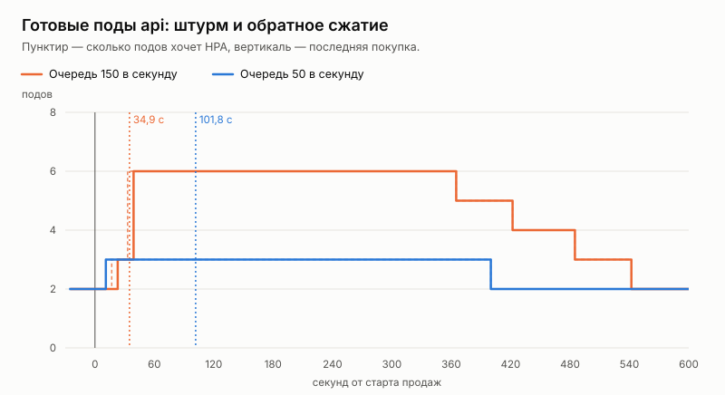
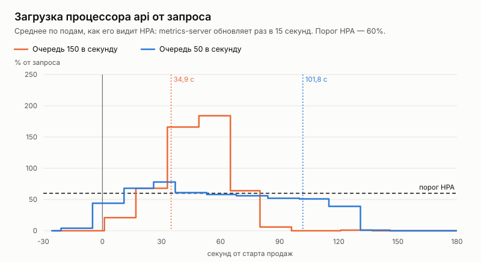

# Эксперимент: автомасштабирование при штурме и обратное сжатие

Дата: 2026-10-06. Решение — [ADR 032](../../adr/032-kubernetes.md).

## Вопрос

Этап 6 плана развития — Kubernetes. Успевает ли HPA по загрузке процессора добавить поды api, пока идёт штурм стадиона? Возвращается ли он к двум подам после штурма?

## Как мерили

- **Стенд — в облаке.** Workflow «Kubernetes storm» (`.github/workflows/k8s-storm.yml`) на раннере GitHub: 4 vCPU, 16 ГБ, кластер kind из одного узла.
- **Приложение** — `deploy/k8s/overlays/local`, сценарий — `loadtest/k8s-storm.sh`.
- **Штурм.** Концерт на Центральном стадионе (33 509 мест), 5 000 покупателей, путь покупателя — как в ADR 026. k6 работает внутри кластера и ходит в край, как трафик из Ingress.
- **Запрос процессора пода api — 200m** вместо 500m из base. Иначе на машину в 4 ядра помещаются только три пода, и видно было бы только потолок, а не масштабирование.
- **Каждые 5 секунд** записываются: сколько подов хочет HPA, сколько готово, загрузка процессора от запроса. После штурма запись идёт ещё 12 минут.
- **Инвариант** проверяется сразу после штурма.
- **Два варианта** скорости пропуска очереди (ADR 020):
  - **150 в секунду** — как в ADR 026. Штурм длится около 35 секунд.
  - **50 в секунду** — около 100 секунд.

Сырые данные — [`data/`](data/): `hpa.csv`, сводка k6 и проверка инварианта для каждого варианта. Графики собирает `loadseed k8s-report -in data -out .` из этих же файлов.

## Результаты

| | Очередь 150/с | Очередь 50/с |
|---|---:|---:|
| Последняя покупка | 34,9 с | 101,8 с |
| Купили | 4 994 из 5 000 | 5 000 из 5 000 |
| Подов api: максимум | 6 | 3 |
| HPA решил добавить первый под | 17 с | 11 с |
| Все поды готовы | 39 с | 11 с |
| Загрузка процессора api, пик | 184% от запроса | 78% |
| Заказ p95 / p99 | 526 / 656 мс | 13 / 22 мс |
| Занятость сектора p95 | 211 мс | 2 мс |
| Ошибок 5xx и сети | 0 | 0 |
| Вернулся к 2 подам | 542 с | 400 с |
| Двойных броней | 0 | 0 |

Время — от старта продаж.

Ход штурма при очереди 150 в секунду:

| Время | HPA хочет | Готово подов | Загрузка api |
|---:|---:|---:|---:|
| 1 с | 2 | 2 | 21% |
| 17 с | 3 | 2 | 68% |
| 23 с | 3 | 3 | 68% |
| 33 с | 6 | 3 | 166% |
| 39 с | 6 | 6 | 166% |
| 49 с | 6 | 6 | 184% |
| 80 с | 6 | 6 | 6% |

Загрузка в таблице запаздывает: metrics-server усредняет её за окно и обновляет раз в 15 секунд. Пик 184% на 49-й секунде — это нагрузка конца штурма, а не после него.

Тот же вариант до исправления проверки инварианта прогнали ещё дважды. По подам картина та же: 2 → 6 и 2 → 5, все поды готовы на 33–36-й секунде, к двум подам — на 469–540-й. Инвариант в этих прогонах проверялся после истечения холдов и ничего не доказывал, поэтому в таблицу они не вошли.

## Разбор

**Обратное сжатие работает, как задумано.**
- Через 5 минут после штурма HPA снимает по поду в минуту.
- При очереди 150 в секунду: 6 → 2 к 542-й секунде от старта продаж. Первый под снят на 365-й: через 300 секунд окна стабилизации после того, как загрузка упала (около 65-й секунды). Остальные три — по одному в минуту, на 422, 485 и 542-й секунде.
- Ни одной ошибки при снятии: поды выходят через `preStop` и корректную остановку.

**Масштабирование вверх запаздывает на полминуты — и на коротком штурме не помогает.**
- При очереди 150 в секунду штурм кончился на 35-й секунде, а новые поды были готовы на 39-й.
- Все покупатели прошли через два-три пода. Заказ p95 — полсекунды.
- Шесть подов пришли к пустому залу.

Откуда запаздывание:
- metrics-server собирает загрузку раз в 15 секунд;
- HPA пересчитывает раз в 15 секунд;
- под ещё стартует и проходит пробу готовности.

Это 20–30 секунд, даже с поведением «вверх сразу» (ADR 032). Короче не сделать без собственного сбора метрик.

**Скорость очереди — главный рычаг.**
- При 50 покупателях в секунду трёх подов хватило: заказ p95 — 13 мс. Загрузка держалась на 51–78% от запроса, временами выше порога 60%, но четвёртый под HPA не добавил.
- HPA добавил третий под на 11-й секунде, дальше подов не прибавлялось.
- Цена — время: последний покупатель прошёл на 102-й секунде вместо 35-й.

Очередь задаёт нагрузку на api, а значит, и число подов, которое нужно на старте продаж. Это число известно заранее.

**Вывод для продакшена: на старт продаж поды поднимаются заранее.**
- Время старта продаж известно заранее. Реактивный HPA при штурме короче минуты опаздывает.
- Поэтому `minReplicas` api на время старта продаж нужно поднимать по расписанию, по скорости очереди события. HPA остаётся страховкой от непредвиденной нагрузки и отвечает за обратное сжатие.
- Это был вариант «на будущее» в ADR 032; эксперимент делает его необходимым для больших событий.

**Корректность от числа подов не зависит.**
- Двойных броней ноль в обоих вариантах.
- 4 994 и 5 000 активных заказов — столько же, сколько покупок у k6.
- Решение о месте принимает база и Redis, а не под (ADR 023).

## Ограничения

- **Один узел.** Поды, PostgreSQL, Redis и k6 делят 4 vCPU. Пик загрузки на 166–184% от запроса значит, что поды api брали свободные ядра сверх запроса — лимита процессора нет (ADR 032). На кластере с отдельными узлами картина та же по времени, но новые поды получали бы свои ядра.
- **Запрос 200m вместо 500m.** Абсолютное число подов на продакшене будет меньше; запаздывание HPA от запроса не зависит.
- **По одному прогону на вариант** с исправленной проверкой. Ещё два прогона варианта 150/с подтверждают время масштабирования.
- **Край и воркер не масштабировались.** Их загрузка не дошла до порога: на этой нагрузке хватает двух подов.
