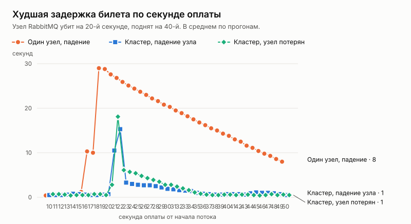

# Эксперимент: отказ RabbitMQ посреди продажи

Дата: 2026-10-06. Решение по итогам — [ADR 030](../../adr/030-rabbitmq-cluster.md).

## Вопрос

Этап 4 плана развития (spec.md) — отказоустойчивость. Последняя зависимость после api, PostgreSQL и Redis (ADR 027–029) — RabbitMQ.

Через очередь идёт путь от оплаты до билета (ADR 012):
1. модуль оплаты пишет событие `payment.succeeded` в outbox;
2. воркер публикует его в RabbitMQ;
3. бронирование подтверждает заказ и пишет `order.paid`;
4. снова outbox и очередь;
5. выпуск билетов.

Сама продажа мест от RabbitMQ не зависит. Вопросы:
- не потеряется ли оплата, если узел брокера упал;
- сколько покупатель ждёт билет;
- что дают три узла и кворумные очереди.

## Как мерили

Серия `loadtest/mqchaos.sh`:
- **Поток.** `loadseed paystream` заранее создаёт 6 000 заказов по одному месту и пишет в outbox оплаты: 100 в секунду в течение 60 секунд. Это то, что пишет модуль оплаты, получив вебхук провайдера. Дальше путь настоящий: релей воркера, RabbitMQ, бронирование, снова outbox и очередь, выпуск билетов.
- **Воркеры.** Два экземпляра, как при горизонтальном масштабировании (ADR 023).
- **Стенд:**
  - **один узел** — как в Compose;
  - **кластер** — три узла (`deploy/ha`), кворумные очереди, воркеры знают все узлы.
- **Отказ.** На 20-й секунде потока узел убивают (SIGKILL), на 40-й поднимают снова. В кластере убивают `rabbit-0`: воркеры подключены к нему первыми, поэтому на нём ведущие копии их очередей — худший случай. Ещё один вариант — узел не возвращается.
- **Проверки** (`loadseed tickets-check`):
  - сколько оплаченных заказов получили билеты через 3 минуты после конца потока;
  - через сколько после записи оплаты появился билет;
  - сколько сообщений ушло в очереди `.dead`.

По 3 прогона на вариант. Таблицы — [`tables.md`](tables.md).

## Результаты

| Вариант | Оплат | Без билета | В очередях .dead | Задержка билета, медиана | p95 | max |
|---|---:|---:|---:|---:|---:|---:|
| Один узел, без отказа | 18 000 | 0 | 0 | 0,3 с | 0,4 с | 0,5 с |
| Кластер, без отказа | 18 000 | 0 | 0 | 0,5 с | 0,8 с | 1,4 с |
| Один узел, падение на 20 с | 18 000 | **0** | 0 | **7,7 с** | **25,7 с** | **30,1 с** |
| Кластер, падение узла на 20 с | 18 000 | **0** | 0 | **0,5 с** | **2,9 с** | **23,0 с** |
| Кластер, узел не вернулся | 18 000 | **0** | 0 | 0,4 с | 5,1 с | 22,5 с |

## Разбор

**Оплата не теряется ни при каком отказе.** Ни одна из 90 000 оплат не осталась без билета, в очереди `.dead` не ушло ни одного сообщения. Это держит outbox:
- событие лежит в PostgreSQL, пока брокер не подтвердил, что принял его;
- брокер лежит — релей повторяет;
- брокер принял, но подтверждение потерялось — событие уйдёт ещё раз, и обработчик повтор распознает (ADR 012).

**Один узел: билеты ждут, пока брокер не вернётся.**
- 20 секунд простоя, плюс около 5 секунд старта узла, плюс до 5 секунд, пока воркеры переподключатся.
- Оплаты этого времени копятся в outbox, а после возвращения брокера проходят за пару секунд. На графике это убывающая линия: чем позже пришла оплата, тем меньше она ждала.
- Медиана по всему потоку — 7,7 секунды, худшая задержка — 30 секунд.
- Сколько продлится простой, зависит от того, кто и как быстро поднимет узел.

**Кластер: почти все билеты выходят как обычно.**
- Ведущие копии очередей переходят на живые узлы, воркеры переподключаются ко второму узлу из списка.
- Медиана не изменилась (0,5 с), p95 — 3–5 секунд.

**Хвост в 22–23 секунды — сообщения, которые потребитель на упавшем узле уже взял в работу.**
- Это 10–20 оплат на падение: столько воркер берёт наперёд (prefetch 10 на очередь).
- Кворумная очередь не отдаёт их другим потребителям сразу: при разделении сети отрезанный узел мог бы их уже обработать. Она ждёт `consumer_disconnected_timeout`.
- По умолчанию это минута: в первом прогоне с потерянным узлом худшая задержка была 67,6 секунды. Теперь 15 секунд — обработчики идемпотентны, и повтор после короткого разделения безопасен.
- Остальные 7–8 секунд — пока кластер замечает, что узел пропал, и выбирает новые ведущие копии.

**Узел, который не вернулся, — то же, что упавший и поднятый.** Кластеру не нужен вернувшийся узел, чтобы продолжить работу: двое из трёх — большинство.

## Что нашли по дороге

1. **Классические очереди.** Классическая очередь живёт на одном узле: с ним пропадает и она. Очереди теперь кворумные, а пустые классические заменяются автоматически (ADR 030).
2. **Клиент знал один адрес брокера.** Теперь в `RABBITMQ_URL` — все узлы через запятую, и после обрыва клиент сначала пробует другие.
3. **Пауза переподключения до 30 секунд.** Она удваивалась при каждой неудаче, и на одном узле потребитель вернулся на 6 секунд позже брокера. Теперь потолок — 5 секунд.
4. **Таймаут потребителя на недоступном узле — минута по умолчанию.** Снижен до 15 секунд: 67,6 → 22,5 секунды худшей задержки при потере узла.
5. **api был «не готов» без RabbitMQ, хотя RabbitMQ ему не нужен.** То же с Redis: api без него работает (ADR 018), но `/readyz` отвечал 503. На этапе 6 оркестратор вывел бы из ротации все экземпляры api разом. Теперь `503` — только без PostgreSQL.

## Ограничения

- **Одна машина.** Узлы, воркеры и PostgreSQL — на 4 vCPU.
- **Падение, а не разделение сети.** При разделении узел в меньшинстве останавливается (`pause_minority`), а не продолжает принимать сообщения сам по себе. На стенде это не проверялось.
- **Поток минует модуль оплаты.** Генератор пишет события сразу в outbox, как это делает обработчик вебхука. Сам вебхук от RabbitMQ не зависит.
- **Билеты ждут, а не теряются.** Письмо с билетами покупателю уходит позже на эти секунды; заказ оплачен по времени подтверждения оплаты, а не обработки события (ADR 012), поэтому задержка не отменяет вовремя оплаченный заказ.
- **Три прогона на вариант.**
