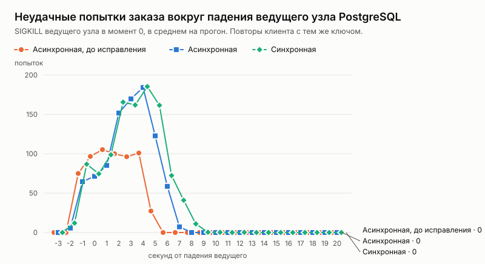

# Эксперимент: падение ведущего узла PostgreSQL посреди продажи

Дата: 2026-10-05. Решение по итогам — [ADR 028](../../adr/028-postgres-failover.md).

## Вопрос

Этап 4 плана развития (spec.md) — отказоустойчивость. После отказа экземпляра api (ADR 027) — отказ базы: посреди продажи падает ведущий узел PostgreSQL, реплика повышается и становится ведущей.

Что важно:
- сколько покупателей останется без билета;
- сколько займёт восстановление;
- не пропадёт ли заказ, который клиент уже получил как созданный;
- не выполнится ли один запрос дважды и не продастся ли место дважды;
- что меняет синхронная репликация по сравнению с асинхронной.

## Как мерили

Серия `loadtest/pgchaos.sh`, сценарий k6 `loadtest/chaos.js`:
- **Кластер.** Три узла PostgreSQL 17 под repmgr (`deploy/ha`): ведущий и две потоковые реплики. Если ведущий не отвечает 3 раза с интервалом 2 секунды, реплики повышают одну из себя.
- **Приложение.** Два экземпляра api за nginx, как в ADR 027. Каждый подключается ко всем трём узлам сразу и выбирает пишущий: `target_session_attrs=read-write`.
- **Поток.** 100 заказов в секунду в течение 60 секунд, событие на 10 000 мест, свой покупатель на каждый заказ.
- **Клиент как сайт** (`web/src/lib/retry.ts`). При обрыве, 502/503/504 и «запрос ещё выполняется» клиент повторяет тот же запрос с тем же ключом идемпотентности. Пауза — сколько просит `Retry-After`, иначе 0,25 с и вдвое больше, не дольше 4 с; всего не дольше 30 секунд.
- **Сценарий отказа.** На 20-й секунде ведущий узел убивают (`docker kill`, SIGKILL), на 40-й поднимают снова, и он встаёт репликой.
- **Варианты:**
  - репликация асинхронная или синхронная, кворумом «любая одна из реплик»;
  - без отказа или с падением ведущего;
  - сборка до исправлений этого этапа (код из main) или после.

  Без отказа — по 3 прогона, с падением — по 5, сборка до исправления — 3.
- **Проверки после каждого прогона:**
  - инвариант (`loadseed check`) — ни одно место не продано дважды;
  - число покупателей с двумя заказами — двойное выполнение одного запроса;
  - **потерянные подтверждения.** Каждый ответ 201 k6 запоминает с id заказа, и после переключения серия проверяет, что все эти заказы есть в базе. Пропавшие id сохраняются в `acked_missing.txt`.
- **Режим репликации проверен** на старте каждого прогона: реплики числятся `quorum` в синхронном варианте и `async` в асинхронном.

Данные по каждому прогону — [`results.csv`](results.csv), таблицы — [`tables.md`](tables.md).

## Результаты

| Вариант | Прогонов | Ушли без билета | Удалось после повторов | Повышение реплики | Восстановление, медиана / p95 / max | Потеряно подтверждённых | Двойных выполнений | Двойных броней |
|---|---:|---:|---:|---:|---:|---:|---:|---:|
| Асинхронная, без отказа | 3 | 0 | — | — | — | 0 | 0 | 0 |
| Синхронная, без отказа | 3 | 0 | — | — | — | 0 | 0 | 0 |
| Асинхронная, падение, до исправления | 3 | **1 805** | 0 | 6 с | — | 0 из 12 511 | 0 | 0 |
| Асинхронная, падение | 5 | **0** | 2 028 | 6–8 с | 7,5 / 10,9 / 16 с | **1 из 22 523** | 0 | 0 |
| Синхронная, падение | 5 | **0** | 2 136 | 5–7 с | 10,3 / 13,9 / 19 с | **0 из 22 591** | 0 | 0 |

Время ответа на заказ без отказа (медиана / p95): асинхронная — 13 / 82 мс, синхронная — 13 / 42 мс.

## Разбор

**До исправления каждое падение ведущего стоило около 600 покупателей.**
- Пока реплика не повышена (6 секунд), api отвечал на каждый заказ 500 «внутренняя ошибка».
- Клиент на 500 не повторяет: ошибка сервера могла означать что угодно. Покупатель уходил без билета: 1 805 человек за три падения.

**После исправления без билета не ушёл никто.**
- На недоступность базы api отвечает `503` с `Retry-After: 2` (ADR 028), и клиент повторяет тот же запрос с тем же ключом.
- Около 400 покупателей на одно падение получили билет после повторов, в среднем через 7,5–10 секунд после первой попытки.
- Неудачных попыток больше, чем до исправления: каждый покупатель теперь повторяет, а не уходит.

**Асинхронная репликация потеряла подтверждённый заказ.**
- В одном из пяти прогонов клиент получил «заказ создан», а после переключения заказа в базе не оказалось.
- Заказ создан за полсекунды до падения ведущего (время зашито в его uuidv7). Ведущий зафиксировал его и ответил клиенту, но запись не успела дойти до реплики, которую повысили.
- В первой, отброшенной серии (см. ниже) асинхронный вариант тоже потерял один заказ.
- Место такого заказа после переключения свободно и может уйти другому покупателю. А первый покупатель считает, что место его, и пойдёт оплачивать заказ, которого нет.

**Синхронная репликация не потеряла ни одного.**
- Ведущий подтверждает фиксацию, только когда её получила хотя бы одна реплика. Поэтому повышенная реплика знает всё, что клиент видел как созданное.
- **Цена без отказов не видна:** время ответа то же, синхронная даже быстрее на p95 — это разброс прогонов, а задержка до реплики на одной машине — доли миллисекунды.
- **Цена при отказе** — восстановление дольше на 3 секунды по медиане. Вероятная причина: после повышения новый ведущий не подтверждает фиксации, пока к нему не переключится оставшаяся реплика.

**Корректность не зависит от переключений.**
- Двойных броней — ноль во всех 19 прогонах.
- Двойных выполнений — ноль после исправлений, о которых ниже.

**Восстановление дольше повышения реплики.** Реплику повышают за 5–8 секунд, а повтор клиента проходит в среднем через 7,5–10 секунд, в худшем — через 16–19. Две причины:
- **Паузы клиента.** Повтор идёт раз в 2 секунды (`Retry-After`), и после повышения ещё ждёт свою очередь.
- **Очередь пула.** Пока ведущего нет, каждый запрос пытается подключиться ко всем трём узлам. Реплики проходят аутентификацию и только потом отвечают «только чтение». Попытки встают в очередь пула соединений, и время ответа 503 растёт на ~0,6 с за секунду простоя, а после повышения запросы ещё несколько секунд разбирают эту очередь (заказ p95 в прогонах с падением после исправлений: асинхронная — 1,8–4,8 с, синхронная — 4,0–6,6 с).
- **Что не помогло.** `connect_timeout` очередь не убирает: узлы отвечают, просто медленно.
- **Что поможет.** Быстрый отказ без попыток подключения на время простоя (circuit breaker). Это следующий шаг, если восстановление понадобится короче.

## Что нашли по дороге

Серия прогонялась четыре раза. Каждый прогон находил то, что первые прогоны не показывали.

1. **Синхронная репликация была синхронной до первого переключения.** Образ задаёт синхронность только начальному ведущему. После первого переключения новый ведущий становился асинхронным, и «синхронные» прогоны 2–3 на двух узлах шли асинхронно. Исправлено: три узла и одинаковая настройка на каждом (ADR 028).
2. **Двойное выполнение заказа.** Ведущий зафиксировал заказ, но упал раньше, чем ответил приложению. api не знал исхода, ответил 503, и повтор клиента создал заказ заново, отменив первый. Место осталось продано один раз, но сущностей стало две — нарушение правила 3. Исправлено: ключ запроса хранится в самом заказе, в той же транзакции.
3. **Сайт не повторял запросы.** Эксперимент моделировал клиента, который повторяет запрос при 503, а клиент сайта показывал покупателю ошибку. Исправлено: сайт повторяет так же, как клиент эксперимента.
4. **Потерянное занятие ключа.** Ключ идемпотентности занялся, подтверждение потерялось вместе с ведущим. Ключ остался «выполняется», повторы минуту получали 409, и покупатель ушёл без билета. Исправлено: свой ключ, который экземпляр не обрабатывает, считается брошенным.

Пункты 2 и 4 — один класс ошибки: неизвестный исход фиксации. Его не бывает, пока база не падает посреди транзакции, поэтому юнит-тесты и предыдущие эксперименты его не видели.

## Ограничения

- **Одна машина.** Узлы, api, k6 — на 4 vCPU. Сетевой задержки до реплики почти нет, поэтому цена синхронной репликации на продакшене будет выше, чем здесь (внутри одного дата-центра — доли миллисекунды на фиксацию).
- **100 заказов в секунду.** Под большей нагрузкой отставание асинхронной реплики растёт, и окно потери тоже.
- **Падение, а не разделение сети.** Ведущий убит, а не отрезан от реплик. При разделении он мог бы продолжать принимать запись рядом с новым ведущим. repmgr от этого не защищает, поэтому продакшен-рекомендация — Patroni с etcd или управляемый PostgreSQL (ADR 028).
- **Быстрый возврат бывшего ведущего.** Если поднять его через 1–2 секунды после падения, раньше, чем реплики признают его упавшим, repmgr может оставить два ведущих. В эксперименте он возвращается через 20 секунд.
- **Время точек k6 — с точностью до секунды.** На графике первые неудачи видны на секунду раньше падения: это округление, а не сбой до него.
- **Пять прогонов на вариант с отказом.** Потеря подтверждённого заказа — редкое событие: 1 из 5 прогонов, и ещё 1 в отброшенной серии. Синхронная — 0 из 5 и 0 в отброшенной серии на трёх узлах.
