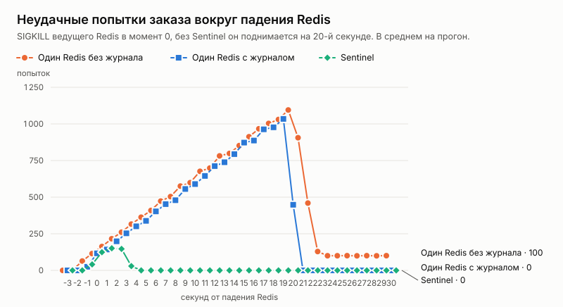

# Эксперимент: падение Redis посреди продажи

Дата: 2026-10-05. Решение по итогам — [ADR 029](../../adr/029-redis-failover.md).

## Вопрос

Этап 4 плана развития (spec.md) — отказоустойчивость. После api (ADR 027) и PostgreSQL (ADR 028) — Redis: в нём холды мест, сессии, коды входа и очередь ожидания.

Приложение уже умеет работать без Redis (ADR 017, 018, 020). Поэтому вопрос не только «переживём ли простой», а:
- что Redis теряет, когда поднимается снова;
- сколько длится простой и сколько покупателей его не дождутся;
- что дают журнал на диске и реплики с Sentinel.

## Как мерили

Серия `loadtest/redischaos.sh`, сценарий k6 `loadtest/chaos.js`. Стенд — как в экспериментах ADR 027 и 028:
- **Приложение.** Два экземпляра api за nginx.
- **Поток.** 100 заказов в секунду в течение 60 секунд, событие на 10 000 мест, свой покупатель на каждый заказ.
- **Клиент как сайт** (`web/src/lib/retry.ts`). При обрыве, 502/503/504 и «запрос ещё выполняется» клиент повторяет запрос с тем же ключом. Пауза — сколько просит `Retry-After`, умноженная на случайное число от 0,5 до 1,5; повторы не дольше 30 секунд.
- **Покупатели входят перед стартом продаж**, как на настоящей продаже: стенд и сессии создаются заново на каждый прогон.
- **Сценарий отказа.** На 20-й секунде ведущий Redis убивают (SIGKILL), на 40-й поднимают снова.

**Варианты стенда:**
- **один Redis без журнала** — настройки по умолчанию, как было в Compose: только снимки (RDB);
- **один Redis с журналом** — AOF, fsync раз в секунду;
- **Sentinel** — три узла с журналом и три Sentinel (`deploy/ha`), api ищет ведущий через Sentinel.

По 3 прогона на вариант.

**Проверки после каждого прогона:**
- инвариант (`loadseed check`);
- двойное выполнение — два заказа у одного покупателя;
- **холды Redis против базы** (`loadseed holds-check`):
  - «призрачный» холд — ключ в Redis есть, а в базе место свободно или держится другим заказом;
  - пропавший холд — в базе держится, в Redis ключа нет.

Данные по каждому прогону — [`results.csv`](results.csv), таблицы — [`tables.md`](tables.md).

## Результаты

| Вариант | Ушли без билета | Неудачных попыток | Запись снова доступна | Восстановление, медиана / max | Пропало холдов | Призрачных холдов | Двойных броней |
|---|---:|---:|---:|---:|---:|---:|---:|
| Один Redis, без отказа | 0 | 0 | — | — | 0 | 0 | 0 |
| Sentinel, без отказа | 0 | 0 | — | — | 0 | 0 | 0 |
| Один Redis без журнала, падение | **12 130 из 17 907** | 47 915 | через 20 с | — | **все: 5 250** | 0 | 0 |
| Один Redis с журналом, падение | 0 | 35 773 | через 20 с | 14,9 / 27,6 с | 1 | 0 | 0 |
| Sentinel, падение ведущего | **0** | **1 475** | **через 3 с** | **2,8 / 6,4 с** | 2 | 0 | 0 |

Время ответа на заказ без отказа (медиана / p95): один Redis — 11 / 17 мс, Sentinel — 11 / 21 мс.

## Разбор

**Один Redis без журнала после перезапуска выкидывает всех из аккаунтов.**
- Пока Redis лежит, покупатели получают `503` и ждут: проверить сессию негде.
- Поднявшись, Redis пуст: снимок на диске старше, чем вход покупателей перед продажей. Каждая проверка сессии отвечает «сессии нет», и api возвращает `401 invalid_session`, а сайт выкидывает покупателя из аккаунта.
- На графике это ровная полка в 100 отказов в секунду после 22-й секунды: так уходит каждый новый покупатель до конца прогона.
- **Итог: 68% покупателей без билета.** Вместе с сессиями пропали все холды мест и очередь ожидания — в этом потоке её нет, но в настоящей продаже пришедшие встали бы в неё заново, в конец.
- Кэш сессий в памяти api (ADR 018) не помог: каждый покупатель здесь новый, его сессию api ещё не видел. Покупатель, который заранее открыл страницу события, прошёл бы, пока Redis лежит, — но не после того, как Redis поднялся пустым.

**Один Redis с журналом никого не потерял, но держит покупателей на грани.**
- После перезапуска журнал вернул все сессии и холды; пропал один холд — последняя секунда до падения.
- Но 20 секунд простоя покупатели ждут: медиана — 15 секунд, худший — 27,6 из 30, которые сайт готов повторять.
- Простой длится, пока узел не поднимут. Здесь — 20 секунд по сценарию, на продакшене это зависит от того, кто и как быстро заметит падение.

**Sentinel: 3 секунды простоя, и покупатель почти ничего не замечает.**
- Sentinel признал ведущий упавшим за 2 секунды и повысил реплику ещё за секунду. go-redis сам нашёл новый ведущий.
- Неудачных попыток в 24 раза меньше, чем у одного Redis с журналом: около 500 за падение вместо 12 тысяч.
- Медиана ожидания — 2,8 секунды, худший случай — 6,4.
- Реплики получают записи асинхронно. В эксперименте после переключения пропало 0–2 холда на прогон, сессии не пропали.

**Корректность не зависит от Redis.**
- Двойных броней — ноль во всех 15 прогонах, даже когда пропали все холды. Место продаёт база, Redis только отсекает конкурентов.
- Двойных выполнений — ноль.
- Призрачных холдов — ноль. Но поток этого эксперимента не отменяет и не заменяет корзины, поэтому снятий холдов, которые могли бы пропасть, почти нет (см. ограничения).

## Что нашли по дороге

1. **Пауза в 5 секунд на «хранилище сессий недоступно».** Она осталась от ADR 018, когда Redis был один. С Sentinel простой — 3 секунды, а покупатель ждал 5. После снижения до 2 секунд медиана восстановления — 2,8 секунды вместо 5,4.
2. **Синхронная лавина повторов.** Без случайного разброса пауз около двух тысяч покупателей, ждавших один и тот же простой, повторяли в одну и ту же секунду. Сразу после подъёма Redis пошли обрывы и 502. Теперь пауза умножается на случайное число от 0,5 до 1,5 — и на сайте, и в клиенте эксперимента.
3. **Лимит соединений балансировщика стенда.** За 20 секунд простоя набирается около двух тысяч ждущих покупателей. Стандартный лимит nginx (1024 соединения на процесс, и каждое проксируемое соединение занимает два) начинал рвать соединения, и в одном прогоне это превратилось в шторм повторов: 1 104 покупателя исчерпали 30 секунд. Лимит стенда поднят, у продакшен-балансировщика он заметно выше.

Пункты 2 и 3 — не про Redis, а про долгий простой любой зависимости: ждущие покупатели копятся и приходят разом.

## Ограничения

- **Одна машина.** Узлы Redis, api, PostgreSQL и k6 — на 4 vCPU.
- **Падение, а не разделение сети.** Бывший ведущий, отрезанный от Sentinel, но видимый клиентам, принимал бы записи, которые потом пропадут. Защита — `min-replicas-to-write` на узлах; на стенде не включена, в продакшен-настройке её стоит включить (ADR 029).
- **Нет отмен и замен корзины.** Призрачный холд появляется, когда пропадает снятие холда: заказ отменён, а ключ в Redis остался. В этом потоке снятий почти нет, поэтому эксперимент не измеряет, как часто это бывает. Вред — «место занято» до 10 минут на свободное место — описан в ADR 029.
- **k6 пропускал итерации при долгом простое** (40–85 из 6 000 за прогон у одного Redis): ему не хватало виртуальных покупателей на всех ждущих. На сравнение вариантов это не влияет.
- **Три прогона на вариант.**
