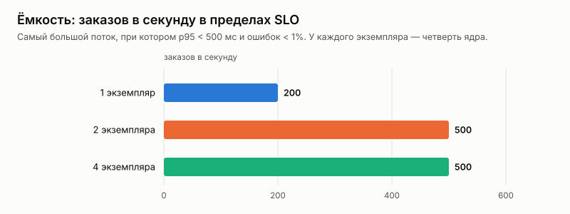
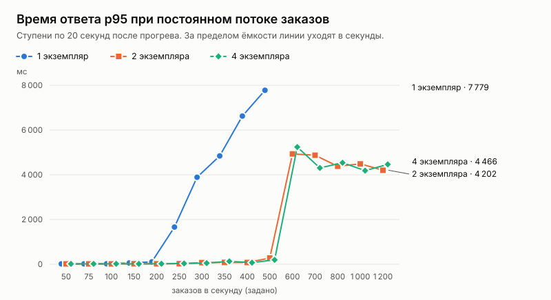

# Эксперимент: горизонтальное масштабирование api

Дата: 2026-10-03. Решение и устройство — [ADR 023](../../adr/023-horizontal-scaling.md).

## Вопрос

Этап 2 плана развития (spec.md). Растёт ли пропускная способность, если поставить несколько экземпляров api за балансировщиком? Где кончается рост и что становится узким местом?

## Как мерили

Сценарий k6 `capacity.js`, серия `loadtest/scale.sh`:
- **Нагрузка.** Постоянный поток заказов с заданной частотой. Каждый заказ — случайный покупатель из 5000 с настоящей сессией берёт случайное место в зале на 6000 мест (100 × 60). Новый заказ покупателя заменяет его прежнюю корзину, поэтому места возвращаются в оборот и зал не кончается. «Место занято» (409) — нормальный исход.
- **Ступени.** От 50 до 1200 заказов в секунду, по 20 секунд. Ступени 600–1200 для 2 и 4 экземпляров добавлены вторым запуском: в первом обе конфигурации прошли верхнюю ступень 500.
- **Экземпляры.** 1, 2 и 4 экземпляра api. Каждый — отдельный контейнер с лимитом в четверть ядра, у каждого свой пул из 20 соединений с базой. Перед ними nginx с тем же устройством, что `api-lb` в Compose.
- **Прогрев.** Перед каждой конфигурацией — 20 секунд по 100 заказов в секунду, в отчёт не входит. Он наполняет кэши и пулы соединений новых экземпляров.
- **Ёмкость** — самый большой поток, при котором p95 ответа ниже 500 мс, ошибок меньше 1% и k6 успевал выпускать запросы с заданной частотой.
- **Загрузка процессора.** `docker stats` во время каждой ступени: экземпляры api, PostgreSQL, k6.
- **Стратегия захвата** — продуктовая, Redis + БД (ADR 017).
- **Лимиты выключены.** Очередь ожидания и лимит на IP отключены: все покупатели k6 приходят с одного адреса.
- **Инвариант.** После каждой конфигурации `loadseed check` проверял его по данным в базе.

Стенд ([`env.json`](env.json)): одна машина, 4 vCPU. Генератор нагрузки, балансировщик, экземпляры api, PostgreSQL и Redis работают на ней же.

Лимит в четверть ядра выбран нарочно. На 4 vCPU рядом работают PostgreSQL, k6 и nginx. С экземплярами по пол-ядра общая машина кончалась раньше, чем api, и график показывал стенд, а не api (см. «Первая серия» ниже).

Данные по каждой ступени — [`results.csv`](results.csv), полные таблицы — [`tables.md`](tables.md).

## Результаты

| Экземпляров api | Ёмкость, заказов в секунду | p95 на пределе ёмкости | CPU экземпляра на пределе, доля лимита | CPU PostgreSQL на пределе |
|---:|---:|---:|---:|---:|
| 1 | 200 | 105 мс | 104% | 0,57 ядра |
| 2 | 500 | 277 мс | 101% | 1,08 ядра |
| 4 | 500 | 194 мс | 69% | 1,00 ядра |

Двойных броней — ноль во всех трёх конфигурациях.

## Разбор

**1 → 2 экземпляра: ёмкость растёт в 2,5 раза, с 200 до 500.**
- Один экземпляр упирается в свой процессор. Уже со 100 заказов в секунду он работает на 100% лимита.
- Дальше задержка растёт очередью: 105 мс на 200, 1,7 с на 250, 3,9 с на 300. Больше 240–266 успешных заказов в секунду он не отдаёт при любом потоке.
- Два экземпляра держат 500 с p95 277 мс. Рост чуть больше двукратного, потому что ступени дискретные. Предел одного — между 200 и 250, двух — между 500 и 600.
- Это и есть ответ этапа: api не хранит состояния, экземпляры не мешают друг другу, нагрузка делится поровну. Ни ошибок, ни двойных броней.

**2 → 4 экземпляра: ёмкость не растёт, узкое место переехало.**
- При 500 заказах в секунду каждый из четырёх экземпляров загружен на 69% лимита, то есть запас у api есть.
- PostgreSQL занимает целое ядро на 500 заказов в секунду и до 1,4 ядра на ступенях выше.
- Вместе с k6 (0,3–0,5 ядра), nginx и сетевым стеком ядра это вся машина. В диагностическом прогоне (4 экземпляра, 600 заказов в секунду) `vmstat` показывал 4–7% простоя процессора.
- Дальше растить api на этом стенде бессмысленно. Следующий предел — база и общая машина, а не api.

**Что это значит для продакшена.**
- PostgreSQL тратит около 0,2% ядра на заказ в секунду. Отдельный сервер базы на 8 ядер — это порядка нескольких тысяч заказов в секунду до упора в процессор базы. С очередью ожидания (ADR 020) поток к покупке задаёт сама платформа.
- Следующие рычаги — в этапах плана:
  - читающий контур и реплики (этап 5) снимают с основной базы всё, кроме захвата и оплаты;
  - компактная занятость больших залов (этап 3) уменьшает работу на каждый запрос схемы.

**За пределом ёмкости.**
- Задержка уходит в секунды, k6 перестаёт успевать выпускать запросы, затем появляются ошибки: до 50% на ступенях 1000–1200.
- Корректность при этом не страдает: двойных броней ноль по итоговой проверке каждой конфигурации, в которую входили и ступени перегрузки. Перегрузка — это отказы и ожидание, а не продажа одного места дважды.

## Первая серия и полуоткрытый предохранитель

Первая серия шла с экземплярами по пол-ядра, ступенями по 15 секунд и без прогрева. Данные: [`gate/before.csv`](gate/before.csv), [`gate/after.csv`](gate/after.csv).

Она нашла ошибку:
- **Симптом.** На одном экземпляре при 400 заказах в секунду p95 вырос до 3,6 с, а в логах api шли открытия предохранителя Redis, хотя Redis был здоров.
- **Причина.** На перегруженной машине одна медленная команда Redis открывала предохранитель на 5 секунд. Все эти 5 секунд проверки сессий отвечали `503`, а захват шёл без холдов Redis, только через базу, медленнее.
- **Исправление.** Предохранитель стал полуоткрытым: пока он открыт, раз в 100 мс один запрос проверяет Redis, и удачная проба закрывает предохранитель сразу (ADR 023).

| Один экземпляр, пол-ядра | До исправления | После |
|---|---:|---:|
| p95 при 400 заказах в секунду | 3 623 мс | 127 мс |
| Не выпущено k6 при 400 | 471 | 0 |
| Ёмкость | 200 | 400 |

Ёмкость одного экземпляра выросла вдвое без единого нового ядра.

Та же серия показала, почему нужен прогрев. У четырёх только что запущенных экземпляров первая ступень (200 в секунду) дала p95 750 мс: четыре пустых кэша сессий и пулы соединений, которые ещё открываются. В основной серии это снимает прогрев.

## Ограничения

- **Всё на одной машине.** Генератор нагрузки и база на одной машине с api: абсолютные числа ниже, чем на отдельных серверах. Вывод о том, где узкое место, от этого не меняется.
- **Лимит процессора — модель небольшого узла, а не настоящий узел.** Сеть между экземплярами и базой — локальная, без задержек настоящей сети.
- **Только заказ.** Сценарий нагружает самый тяжёлый запрос — заказ с захватом места. Чтение схем и страниц событий — этап 5.
- **Коды ошибок не разбирались.** За пределом ёмкости сценарий считает все ошибки вместе: 5xx, обрывы, таймауты.
- **Один прогон на ступень.** Соседние ступени согласуются между собой, но разброс между повторами не измерен.
