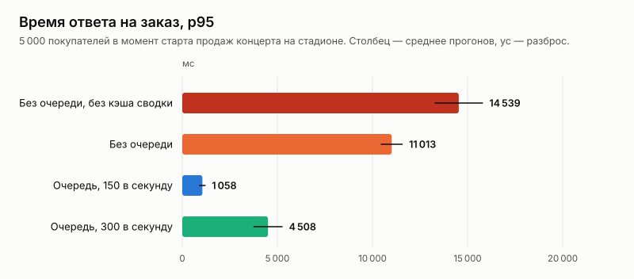
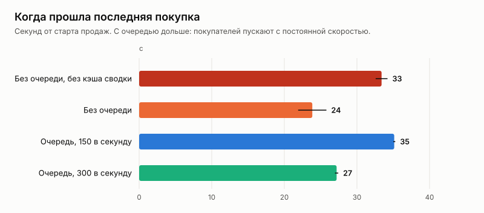

# Эксперимент: штурм стадиона

Дата: 2026-10-05. Решения по итогам — [ADR 026](../../adr/026-stadium-storm.md).

## Вопрос

Этап 3 плана развития (spec.md): выдерживает ли платформа старт продаж на большой площадке. Концерт на Центральном стадионе Алматы, раскладка по образцу концерта Ye в августе 2026 (ADR 025): 33 509 мест — 21 509 на трибунах и 12 000 в фан-зонах на поле.

Что происходит, когда тысячи покупателей приходят в одну секунду:
- какое время ответа;
- сколько данных уходит покупателю;
- продаётся ли место дважды;
- что меняют очередь ожидания и кэш сводки занятости.

## Как мерили

Сценарий k6 `loadtest/stadium.js`, серия `loadtest/storm.sh`. 5 000 покупателей с настоящими сессиями идут путём сайта:

1. **До старта.** В случайный момент последних 30 секунд до старта покупатель открывает страницу события и профиль. Схема стадиона — около 400 КБ, в gzip — 11 КБ; k6 просит сжатие, как браузер. С очередью покупатель встаёт в неё и опрашивает её с интервалом, который советует сервер.
2. **На старте — план.** Покупатель загружает сводку занятости по секторам и выбирает фан-зону или сектор, где хватает мест, с вероятностью по числу свободных мест.
3. **Сектор.** Если выбран сектор — загружает его занятость и берёт 1–4 места рядом в одном ряду. Распределение: 1 билет — 10% покупателей, 2 — 35%, 3 — 20%, 4 — 35%. В фан-зоне — только количество.
4. **Заказ.** Покупатель оформляет заказ. Место заняли — новая попытка с шага 2, всего до четырёх.

Условия:
- **Варианты:** без очереди и без кэша сводки; без очереди; очередь на 150 и на 300 покупателей в секунду. По два прогона, свежий api и новое событие на каждый прогон.
- **Кэш сводки** — 1 секунда в памяти api, кроме варианта «без кэша».
- **Стратегия захвата** — redis (ADR 017). Один экземпляр api, пул 32 соединения.
- **Инвариант** проверялся после каждого прогона по данным в базе (`loadseed check`).
- **Стенд** ([`env.json`](env.json)): одна машина, 4 vCPU и 16 ГБ, k6 там же.
- **Почему 5 000 покупателей, а не больше.** Это предел самого k6 на этой машине: 10 000 виртуальных покупателей заняли 10 ГБ, и ядро остановило k6 по нехватке памяти. 5 000 покупателей хотят около 14 тысяч билетов — 42% стадиона.

Данные по каждому прогону — [`results.csv`](results.csv), таблицы — [`tables.md`](tables.md).

## Результаты

| Вариант | Купили билеты | Билетов | Ошибок сервера | Заказ p50 | Заказ p95 | Последняя покупка | Двойных броней |
|---|---:|---:|---:|---:|---:|---:|---:|
| Без очереди, без кэша сводки | 4 979 из 5 000 | 13 981 | 0 | 10,0 с | 14,5 с | 33 с | 0 |
| Без очереди | 4 983 | 13 945 | 0 | 7,9 с | 11,0 с | 24 с | 0 |
| Очередь, 150 в секунду | **5 000** | 13 926 | 0 | **0,48 с** | **1,06 с** | 35 с | 0 |
| Очередь, 300 в секунду | 4 978 | 13 959 | 0 | 3,0 с | 4,5 с | 27 с | 0 |

| Вариант | Отказов «место заняли» | Сводка p95 | Сектор p95 | Ожидание в очереди p95 | Данных на покупателя |
|---|---:|---:|---:|---:|---:|
| Без очереди, без кэша сводки | 2 638 | 8,9 с | 9,1 с | — | 13 КБ |
| Без очереди | 2 688 | 6,8 с | 7,6 с | — | 13 КБ |
| Очередь, 150 в секунду | 318 | 0,45 с | 0,70 с | 33 с | 14 КБ |
| Очередь, 300 в секунду | 1 890 | 1,9 с | 2,9 с | 19 с | 15 КБ |

## Разбор

**Корректность держится при любой нагрузке.**
- Двойных броней — ноль во всех восьми прогонах.
- Ни одного ответа 5xx и ни одного таймаута, даже когда 5 000 покупателей приходят в одну секунду без очереди.
- Перегрузка видна как ожидание, а не как отказ или продажа одного места дважды.

**Без очереди стадион продаётся, но покупатель ждёт десятки секунд.**
- Заказ p95 — 11 с, сводка и сектор — по 7–8 с.
- Отказов «место заняли» — 2,7 тысячи, по одному на каждого второго покупателя. Пока покупатель смотрит на снимок сектора, который пришёл через несколько секунд, эти места уже взяли другие.
- После четырёх таких попыток 18–22 покупателя уходят без билетов, хотя свободных мест ещё больше половины стадиона.

**Кэш сводки на секунду: заказ на 24% быстрее, последняя покупка — на 9 секунд раньше.**
- Без кэша каждая попытка каждого покупателя считает сводку по 33 тысячам строк мест — `GROUP BY`, около 14 мс процессора базы.
- На старте таких запросов тысячи, и они отбирают базу у заказов.
- С кэшем сводку считает одна попытка в секунду на экземпляр api: заказ p95 — 14,5 → 11,0 с, последняя покупка — 33 → 24 с.
- Сводка всё ещё отвечает медленно (6,8 с p95): без очереди перегружена уже вся машина, а не база.

**Очередь на 150 в секунду — та же продажа без ожидания на покупке.**
- Заказ p95 — 1,06 с вместо 11, в 10 раз быстрее.
- «Место заняли» — 318 раз вместо 2 688: покупатели приходят к плану постепенно и видят свежую занятость.
- Билеты купили все 5 000 покупателей.
- Платит покупатель ожиданием в очереди с номером: p95 — 33 с.
- Последняя покупка — на 35-й секунде: столько нужно, чтобы пропустить 5 000 человек по 150 в секунду. Без очереди с кэшем сводки последняя покупка прошла на 11 секунд раньше, на 24-й секунде; без кэша — на 33-й, почти одновременно с очередью. Зато заказ без очереди по медиане шёл 8–10 секунд.

**Очередь на 300 в секунду для этого стенда слишком быстрая.**
- Путь покупателя — сводка, сектор, заказ, а при отказе ещё раз. 300 покупателей в секунду дают больше тысячи запросов в секунду вдобавок к опросам очереди.
- Это выше ёмкости одного экземпляра на этой машине (ADR 023): заказ p95 — 4,5 с, «место заняли» — 1 890.
- Скорость пропуска надо подбирать по ёмкости, как и советовал ADR 020. Здесь она между 150 и 300 покупателями в секунду на экземпляр.

**Данные покупателю — 13–15 КБ на весь путь.**
- Схема стадиона приходит в gzip — 11 КБ вместо 400 (ADR 024).
- Сводка — 3 КБ, сектор — до 8 КБ, даже когда сектор распродан.
- С полным списком занятых мест, как было до ADR 024, каждое обновление на почти распроданном стадионе стоило бы полмегабайта.

**Фан-зоны забирают отказников.**
- Без очереди в фан-зоны ушло 7,2 тысячи билетов, с очередью на 150 в секунду — 5,3 тысячи.
- Покупатель, у которого заняли места на трибуне, на следующей попытке чаще выбирает фан-зону: свободных мест там больше, а «занять» количество нельзя.

## Ограничения

- **Всё на одной машине.** k6, api, PostgreSQL и Redis на 4 vCPU. Абсолютные числа ниже, чем на отдельных серверах; сравнение вариантов корректно.
- **5 000 покупателей, а не весь стадион.** Распродажа до нуля не проверена: спрос — 42% мест. Это предел генератора нагрузки на этой машине, а не платформы.
- **Без оплаты.** Покупатели k6 не платят: места остаются в холде, как в первые 10 минут после заказа.
- **Решения покупателей k6 мгновенные.** Живые люди выбирают места десятки секунд и приходят к заказу равномернее.
- **Два прогона на вариант.** Разброс показан в таблицах.
