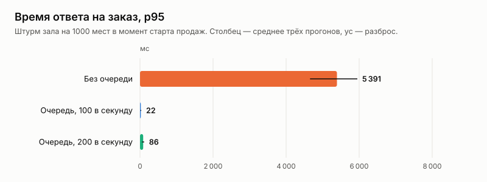
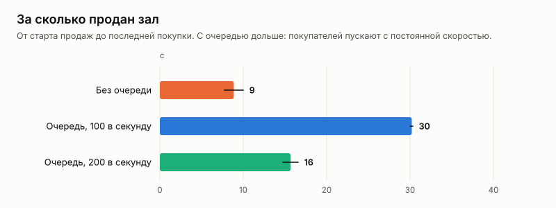

# Эксперимент: очередь ожидания при старте продаж

Дата: 2026-10-02. Решение и устройство очереди — [ADR 020](../../adr/020-waiting-room-and-ip-limit.md).

## Вопрос

Эксперимент со стратегиями захвата ([2026-10-booking-strategies](../2026-10-booking-strategies/README.md)) показал: на 5000 одновременных покупателях даже самая быстрая стратегия отвечает с p95 в несколько секунд. Узкое место — общий путь запроса на четырёх ядрах.

Что даёт очередь, которая пускает покупателей к покупке с постоянной скоростью:
- какой становится задержка покупки;
- не ломается ли что-нибудь;
- чем за это платит покупатель.

## Как мерили

Сценарий k6 `queue` (`loadtest/booking.js`), серия `loadtest/queue.sh`:
- событие с залом на 1000 мест (25 рядов × 40) и объявленным стартом продаж;
- 5000 покупателей с настоящими сессиями;
- стратегия захвата — продуктовая, Redis + БД (ADR 017).

| Вариант | Что делают покупатели |
|---|---|
| Без очереди | ждут старта и в момент старта берут случайное место, при отказе пробуют другое, до трёх раз. Перед стартом открывают профиль, и их сессии попадают в кэш api (как в ADR 018) |
| Без очереди, api только запущен | то же, но без захода на сайт до старта, на только что запущенном api — кэш сессий пуст |
| Очередь, 100 и 200 в секунду | встают в очередь в случайный момент последних 15 секунд до старта, опрашивают своё место с интервалом, который советует сервер, и, когда пропустят, покупают так же — до трёх попыток |

- **Повторы.** По три прогона на вариант, кроме «api только запущен» — это один прогон, который так и получился в первой серии. Он показал проблему, ради которой стоит его разобрать.
- **Инвариант.** После каждого прогона `loadseed check` проверял его по данным в базе.
- **Стенд** (`env.json`) тот же, что в эксперименте ADR 017: одна машина, 4 vCPU, k6, api, PostgreSQL и Redis рядом.
- **Лимит на IP выключен.** Все покупатели k6 приходят с одного адреса.

Данные по каждому прогону — [`results.csv`](results.csv), таблицы — [`tables.md`](tables.md).

## Результаты

| Вариант | Продано мест | Ошибок | Заказ p50 | Заказ p95 | Заказ p99 | Захват на сервере p95 | Зал продан за | Двойных броней |
|---|---:|---:|---:|---:|---:|---:|---:|---:|
| Без очереди | 1 000 | 0 | 2 986 мс | 5 391 мс | 5 686 мс | 3 131 мс | 9 с | 0 |
| Очередь, 100 в секунду | 1 000 | 0 | 6 мс | 22 мс | 52 мс | 13 мс | 30 с | 0 |
| Очередь, 200 в секунду | 1 000 | 0 | 15 мс | 86 мс | 235 мс | 45 мс | 16 с | 0 |
| Без очереди, api только запущен | 133 | 4 866 (503) | — | — | — | — | — | 0 |

Ожидание в очереди и опросы:

| Вариант | Ожидание p50 | p95 | максимум | Опросов на покупателя | Опрос p95 |
|---|---:|---:|---:|---:|---:|
| Очередь, 100 в секунду | 26 с | 49 с | 52 с | 7 | 5 мс |
| Очередь, 200 в секунду | 14 с | 25 с | 27 с | 6 | 36 мс |

## Разбор

**Покупка становится мгновенной: p95 с 5,4 с до 22 мс, в 245 раз.**
- Без очереди 5000 запросов приходят за одну секунду и стоят в очереди к пулу соединений и процессору: захват на сервере p95 — 3,1 с.
- С очередью к покупке одновременно приходят единицы покупателей, и каждый запрос обслуживается в режиме малой нагрузки: 13 мс на сервере.
- При 200 в секунду задержка выше (86 мс), но всё ещё в 60 раз меньше, чем без очереди.

**Платит покупатель ожиданием, а зал продаётся дольше.**
- Без очереди зал продан за 9 секунд, с очередью 100 в секунду — за 30, 200 в секунду — за 16.
- Очередь не ускоряет продажу, она делает её предсказуемой. Покупатель видит своё место и время ожидания, а не крутящееся колесо, которое может закончиться таймаутом.
- Скорость пропуска — настройка. Чем она выше, тем меньше ждут и тем выше задержка покупки. На этом стенде 200 в секунду ещё держит p95 ниже 100 мс.

**Опросы очереди не создают нового пика.**
- Сервер советует, когда спросить снова: половину оставшегося ожидания, от 2 до 20 секунд.
- В итоге 6–7 опросов на покупателя за всё ожидание, опрос отвечает за 5–36 мс.
- С опросом каждые 3 секунды, как в первой версии сайта, было бы около 11 опросов на покупателя при 100 в секунду: в среднем 7,5 секунды до старта и 26 после.

**Главная находка — холодный старт.**
- На только что запущенном api 97% покупателей получили `503 session_store_unavailable`, продано 133 места из 1000.
- Причина:
  - 5000 одновременных проверок сессии заняли больше бюджета предохранителя Redis (300 мс, ADR 018);
  - предохранитель сработал;
  - кэш сессий был пуст — ни один покупатель ещё не заходил.
- Это не отказ Redis, а та же перегрузка общего пути запроса. Такое бывает в жизни: перезапуск api перед популярным стартом, новый экземпляр при масштабировании.
- С очередью этого не случается по построению: покупатели приходят к api постепенно, и их сессии проверяются и попадают в кэш задолго до покупки.
- Без очереди тот же стенд работал, только если покупатели заранее заходили на сайт (вариант «Без очереди» выше).

**Корректность не зависит от очереди.** Двойных броней — ноль во всех 10 прогонах. Очередь только сглаживает нагрузку, поэтому при отказе Redis она пропускает всех (ADR 020).

## Ограничения

- Все компоненты и генератор нагрузки на одной машине: абсолютные числа завышены, сравнение вариантов корректно.
- Покупатели k6 решают мгновенно. Живые выбирают места десятки секунд, поэтому пропущенные очередью приходят к покупке ещё равномернее.
- Покупатели после продажи всех мест продолжают получать «занято»: в продукте сайт показывает, что свободных мест нет, и до заказа они не доходят.
