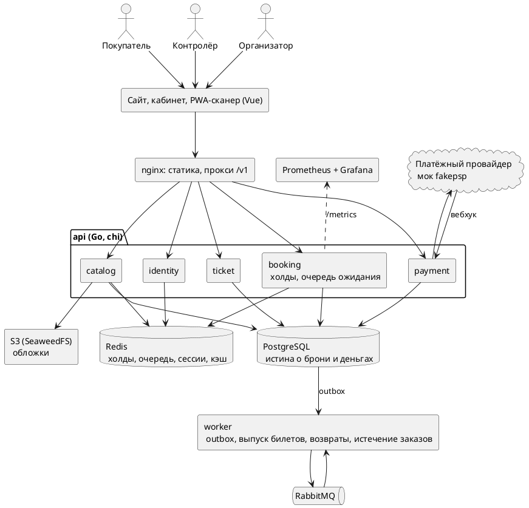

# Дипломный проект: билетная платформа для мероприятий

Sep 24, 2026 · @ami

Тема рабочая при одном условии: на защите продаётся не «сайт продажи билетов», а инженерное ядро (конкурентное бронирование под нагрузкой) плюс бизнес-модель ниши, где нет прямого столкновения с Freedom Ticketon.

## Паспорт проекта

Продукт — SaaS для организаторов мероприятий: организатор сам заводит событие, схему зала и продаёт билеты со своего сайта и соцсетей, без выхода на чужую витрину.

**Проблема.** Билетные операторы в Казахстане берут с организатора комиссию 8–10%. Организаторам, которые приводят аудиторию сами (конференции, стендап, лекции, локальные фестивали, спортклубы), витрина оператора не нужна, а комиссию они платят полную.

**Почему не маркетплейс.** Freedom Ticketon работает с 2012 года, продал около 20 млн билетов, сотрудничает с более чем 3000 партнёров и покрывает свыше 43% кинотеатров и более 87% театров страны. Конкурировать витриной бессмысленно, и комиссия это увидит первой.

**Целевой пользователь:** организатор мероприятия на 100–3000 мест, 2–20 событий в год.

**Решение от 2026-10-03 (бизнес-решение владельца продукта): сразу два сегмента.**
- **МСБ** — как выше: продажа со своего сайта, бесплатный вход для организатора.
- **Крупные организаторы и площадки.** Первое, что для них нужно, — большие площадки: стадионы и арены на 30–50 тысяч мест, сотни тысяч билетов за минуты после старта продаж.
- **Что это меняет.** Тезис «нет прямого столкновения с Ticketon» больше не верен для крупного сегмента. Отличие там — инженерное: продажа без падений в пик и честная очередь. Его надо доказывать экспериментами, как и ядро.
- **Что пока не берём.** Витрину-маркетплейс, роли сотрудников организатора, API и виджет для партнёров, абонементы. Остальная колонка «отрезано» в таблице объёма MVP тоже в силе.
- План — раздел «План развития после MVP».

**Что защищаем на комиссии — три вещи:**

1. Инженерное ядро: корректность продажи мест при конкурентном доступе, подтверждённая нагрузочным экспериментом.
2. Архитектуру, которая масштабируется под всплеск продаж в момент старта.
3. Бизнес-модель с посчитанной юнит-экономикой, а не с процентами «на глаз».

## Объём MVP

Объём рассчитан на одного разработчика за учебный год. Всё, что не входит в MVP, идёт в раздел «развитие продукта» и на защите звучит как осознанно отрезанное.

| Блок | Входит в MVP | Отрезано |
| --- | --- | --- |
| Событие | Создание, категории цен, публикация страницы | Мультиязычность, промо-страницы |
| Зал | Схема мест из редактора, безместные секции | Импорт схем из чужих форматов |
| Покупка | Холд места на 10 минут, оплата, автоотмена просрочки | Продажа абонементов, рассадка группами |
| Оплата | Страница оплаты провайдера (в MVP — мок провайдера), идемпотентные вебхуки, автовозврат опоздавшей оплаты | Сплит-платежи между организаторами, реальный провайдер |
| Билет | Электронный билет по ссылке с подписанным QR, ссылка на почту | PDF, Apple/Google Wallet |
| Контроль входа | PWA-сканер с офлайн-режимом и синхронизацией | Турникеты, аппаратные сканеры |
| Возвраты | Полный и частичный возврат со статусной моделью | Перепродажа между покупателями |
| Кабинет организатора | Продажи, заполняемость, выгрузка отчёта | Маркетинговая аналитика, рассылки |
| Защита продаж | Лимит билетов на аккаунт и IP, очередь ожидания при старте | Полноценный антифрод, скоринг |

Офлайн-режим сканера — не украшение: контролёр на входе часто стоит в фойе или подвале без связи, и это реальный сценарий для защиты.

## Архитектура

Модульный монолит (ADR 001, 004): один бинарь api и воркер, модули с жёсткими границами — catalog, booking, payment, ticket, identity. Модули не импортируют друг друга, а общаются через интерфейсы и события в outbox. Подвисание платёжного шлюза не роняет продажу: оплата и выпуск билетов идут через очередь. Схема ниже — как система устроена сейчас; куда она растёт под крупный сегмент — ADR 021 и «План развития после MVP».



**Ключевые решения и их обоснование:**

| Решение | Зачем |
| --- | --- |
| Холды мест в Redis с TTL | Место освобождается само, без планировщика и без блокировок в БД |
| Истина о брони в PostgreSQL | Redis может потерять данные, деньги — нет |
| Идемпотентность по ключу запроса | Повтор вебхука или ретрай клиента не создаёт вторую бронь и вторую оплату |
| Очередь между оплатой и выпуском билета | Шлюз отвечает медленно и иногда дважды; выпуск билета не должен ждать HTTP |
| Статусная модель заказа | Возвраты и отмены разбираются по переходам, а не по флагам |
| Схема зала кэшируется целиком | Чтение схемы — самый частый запрос, он не должен ходить в БД |

**Стек:** Go (chi, pgx, sqlc, goose), PostgreSQL, Redis, RabbitMQ, Vue с TypeScript (ADR 001), Docker Compose, k6, Prometheus и Grafana. Реализация — модульный монолит: один бинарь api плюс воркер, границы модулей позволяют вынести любой из них в отдельный сервис, когда этого потребует нагрузка (ADR 021).

## Покупатель и организатор

- **Покупатель входит по номеру телефона и SMS-коду**, без пароля и регистрации. Номер — это идентичность покупателя для лимитов и восстановления билетов. Email спрашивается при покупке только для доставки ссылки на билеты. Покупатель общий для всех организаторов.
- **Организатор — отдельный арендатор.** Все его данные (залы, события, заказы, билеты) изолированы от других организаторов.
- **Организатора заводит администратор платформы** через админку после заключения договора. Самостоятельная регистрация не входит в MVP: она требует проверки организатора и модерации событий. Создание организатора сделано отдельной операцией, чтобы позже подключить к ней форму регистрации.
- **У организатора один вход** (владелец). Контролёры на входе не получают учётных записей: организатор создаёт ссылку сканера для конкретного события, она даёт только право сканировать билеты этого события и может быть отозвана.
- **Карточка события:** название, описание, дата и время, площадка, обложка (обязательна; JPEG, PNG или WebP до 5 МБ), видеообложка (необязательна; короткое беззвучное зацикленное видео MP4 или WebM до 15 секунд и 15 МБ, заменяет GIF), возрастное ограничение (0+, 6+, 12+, 16+, 18+).
- **Площадка** — любое место проведения: зал, клуб, парк, открытая площадка. У неё есть адрес и координаты для карты. Мероприятие без мест — это площадка со схемой только из входных зон.
- **Секции без мест** продаются как виртуальные места: секция на 500 человек — это 500 мест без ряда. Для механики продажи они ничем не отличаются от мест с рядом.

## Статусные модели

### Заказ

```
pending ──► paid ──► partially_refunded ──► refunded
   │          └──────────────────────────────► refunded
   ├──► expired
   └──► cancelled
```

| Статус | Смысл |
|---|---|
| `pending` | заказ создан, места удерживаются 10 минут, ждём оплату |
| `paid` | оплачен, билеты выпущены |
| `expired` | 10 минут прошли без оплаты, места свободны |
| `cancelled` | покупатель отменил до оплаты |
| `partially_refunded` | часть билетов возвращена |
| `refunded` | возвращены все билеты |

`expired`, `cancelled` и `refunded` — конечные статусы.

**Оплата после истечения удержания.** Если подтверждение оплаты пришло, когда заказ уже `expired`, заказ не восстанавливается: место могли купить. Платёж автоматически возвращается полностью.

### Платёж

`created → pending → succeeded | failed`. У заказа может быть несколько попыток оплаты, успешной — только одна. Повторное уведомление от шлюза ничего не меняет.

### Возврат

`requested → pending → succeeded | failed`. Возврат относится к конкретным билетам. Сумма успешных возвратов не больше суммы платежа. Статус заказа меняется только после успешного возврата.

### Билет

`issued → used`, `issued → revoked`. Использованный билет не возвращается. Если офлайн-сканеры пропустили билет дважды, при синхронизации засчитывается первое сканирование, второе фиксируется как повторная попытка прохода.

### Правила отмены и возврата (подтверждено 2026-09-28)

| Вопрос | Решение |
|---|---|
| Кто может отменить неоплаченный заказ | только покупатель; неоплаченный заказ и так истекает через 10 минут |
| До какого момента можно вернуть билет | срок задаёт организатор для события; по умолчанию — не позже чем за 24 часа до начала |
| Отмена события организатором | входит в MVP: все оплаченные заказы возвращаются полностью |
| Сервисный сбор при возврате (2026-10-02) | при возврате по желанию покупателя не возвращается; при отмене события возвращается вместе с ценой |

### Оплата и билеты (подтверждено 2026-09-29)

| Вопрос | Решение |
|---|---|
| Где покупатель вводит карту | только на странице платёжного провайдера; платформа карточных данных не видит и под PCI DSS не попадает |
| С каким провайдером работаем в MVP | с моком провайдера (fakepsp) — отдельный сервис со своей страницей оплаты и вебхуками; реальный провайдер подключается позже без изменения остального кода |
| Каким будет билет | электронный билет по ссылке: страница с QR-кодом, место и данные события; ссылка приходит на почту и видна в заказе. PDF и кошельки — после MVP |

### Бесплатные мероприятия и лимит билетов (подтверждено 2026-09-29)

| Вопрос | Решение |
|---|---|
| Бесплатные мероприятия | есть два вида: свободный вход (страница без билетов) и бесплатные билеты (цена 0, заказ оформляется сразу, без оплаты) |
| Лимит билетов на покупателя | на всё событие с учётом уже купленных билетов, а не на один заказ: защита от перекупщиков |
| Лимит билетов с одного IP-адреса (2026-10-03) | 40 билетов на событие, как было предложено (ADR 020) |
| Сбор на больших площадках (2026-10-03) | те же 5% с покупателя, отдельного тарифа для стадионов и арен пока нет |

### Правила бронирования (подтверждено 2026-09-29)

| Вопрос | Решение |
|---|---|
| Сколько мест в одном заказе | не больше лимита билетов на покупателя из карточки события за вычетом уже купленных им на это событие |
| Несколько корзин на событие | у покупателя одна активная корзина на событие; новый выбор заменяет прежний |
| Когда места возвращаются в продажу | сразу после отмены заказа или истечения 10 минут |
| Изменение цен и схемы после публикации | нельзя; целиком редактируется только черновик, обложки можно менять всегда |

## Инженерное ядро

Научно-практическая часть работы — сравнение трёх стратегий захвата места при конкурентном доступе. Это то, что отличает диплом от «я сделал сайт»: есть гипотеза, эксперимент и измеримый результат.

**Сценарий эксперимента.** N виртуальных пользователей одновременно пытаются купить одно и то же место в момент старта продаж. Прогон в k6 на 500, 2000 и 5000 одновременных запросов, по три повтора на каждую стратегию.

| Стратегия | Механизм | Гипотеза |
| --- | --- | --- |
| Пессимистичная блокировка | SELECT FOR UPDATE по строке места | Корректно, но растёт время ожидания и БД становится узким местом |
| Оптимистичная блокировка | Версия строки, повтор при конфликте | Быстрее на низкой конкуренции, много откатов на высокой |
| Очередь на Redis | Атомарный захват ключа места с TTL | Стабильная задержка, но нужен разбор рассинхрона с БД |

**Что измеряем:**

- число двойных броней (целевое значение — ноль во всех прогонах);
- p95 и p99 времени ответа на попытку захвата;
- пропускная способность, успешных захватов в секунду;
- доля откатов и повторов;
- поведение при отказе Redis в середине прогона.

**Результат для защиты:** таблица и графики по трём стратегиям с обоснованием, какая ушла в продукт и почему. Плюс отдельный прогон на корректность: суммарно продано ровно столько билетов, сколько мест, при любом уровне нагрузки.

## Бизнес-модель

Решение от 2026-10-02 (бизнес-решение владельца продукта): **деньги — процент с билета, а не подписка.** Платформа сама проводит оплату, поэтому зарабатывает на ней, как Ticketon и kino.kz, но для МСБ: покупатель платит сервисный сбор 5% (у крупных площадок обычно ~10%), организатор не платит ничего. Сначала был выбран сбор 7%; после разбора чувствительности он снижен до 5%. Исходный вариант «подписка + 1%» оставлен в финмодели как сравнение. В продукте ставка — настройка `SERVICE_FEE_BPS` (ADR 019).

Финмодель — [`docs/business/finmodel.xlsx`](business/finmodel.xlsx), пояснения — [`docs/business/README.md`](business/README.md).

**Юнит-экономика на один билет** (базовый сценарий, допущения): билет 6 000 ₸, сбор 5%.

| Статья | Сумма |
| --- | --- |
| Сервисный сбор с платного билета | 300 ₸ |
| Средняя выручка на проданный билет (с учётом 10% бесплатных и 3% возвратов) | 262 ₸ |
| Эквайринг, 2% от суммы оплаты | −113 ₸ |
| SMS и инфраструктура | −15 ₸ |
| Налог, упрощённый режим 4% | −10 ₸ |
| Маржа | ≈ 123 ₸, 2,1% от цены билета |

Эквайринг берётся со всей суммы оплаты и от ставки сбора не зависит, поэтому маржа очень чувствительна к ставке: при 7% она была бы 221 ₸. При 5% базовый сценарий за три года не окупается (−15 млн ₸, LTV/CAC 2,3). В плюс к 36-му месяцу его выводят эквайринг 1,5% (Kaspi Pay) вместе с привлечением организатора за 100 000 ₸ вместо 150 000 ₸. Таблицы чувствительности — в `docs/business/README.md`.

**Рынок снизу вверх.** Число организаторов в сегменте × события в год × средняя посадка × средний чек × сбор. Для проверки порядка величин есть публичный ориентир: выручка Ticketon за 2021 год оценивалась в 6,1 млн долларов при среднем чеке 11,9 доллара и примерно 42 810 онлайн-заказах в месяц.

**Финплан на три года** — три сценария, помесячно, точка безубыточности, CAC и LTV (лист «Итоги» финмодели). При сборе 5% окупается только оптимистичный сценарий (7-й месяц); базовый показывает, какие условия нужны для окупаемости, пессимистичный — критерий остановки.

**Риски модели:** приём денег за организаторов может требовать статуса платёжной организации или сплит-платежа эквайера; налог считается со сбора только при агентской схеме; ставка 5% на грани окупаемости. Подробно — лист «Риски и источники».

**Выход на рынок.** Первые клиенты — 20–50 организаторов конференций, стендапа и локальных фестивалей, через прямые продажи и бесплатный первый ивент.

## План работ

| Период | Результат |
| --- | --- |
| Октябрь | Утверждение темы, анализ рынка и конкурентов, техническое задание |
| Ноябрь | Архитектура, модель данных, спецификация API, макеты |
| Декабрь | Каталог событий, редактор схемы зала, кабинет организатора |
| Январь | Бронирование и холды, три стратегии захвата места |
| Февраль | Оплата через песочницу шлюза, вебхуки, возвраты |
| Март | QR-билеты, PWA-сканер с офлайн-режимом, отчёты |
| Апрель | Нагрузочные эксперименты, финмодель, сбор результатов |
| Май | Пояснительная записка, презентация, репетиция защиты |

Правило по срокам: если к концу января бронирование не работает под нагрузкой, режем функциональность из колонки «отрезано», а не сдвигаем эксперимент.

## План развития после MVP

MVP готов раньше плана (октябрь 2026 вместо апреля 2027). Оставшееся время — на масштаб и отказоустойчивость под крупный сегмент. Направление архитектуры — ADR 021.

Каждый этап — отдельный PR с экспериментом, который доказывает результат.

| Этап | Что делаем | Чем доказываем |
| --- | --- | --- |
| 1. Наблюдаемость | Метрики HTTP и воркера, экспортёры PostgreSQL, Redis и RabbitMQ, дашборды Grafana, правила алертов | Дашборд показывает каждый прогон эксперимента: продажи, задержку, очередь, ресурсы |
| 2. Горизонтальное масштабирование | Несколько экземпляров api за балансировщиком, проверка, что состояние только в базе и Redis | График пропускной способности: 1 → 2 → 4 экземпляра |
| 3. Большие площадки | Схема на 50 тысяч мест: секторная раскладка, отрисовка на canvas, компактная занятость (битовые карты по секторам и версии вместо списка мест) | Штурм стадиона на 50 тысяч мест: время ответа, объём данных, ноль двойных броней |
| 4. Отказоустойчивость | PostgreSQL с репликой и автоматическим переключением, Redis Sentinel, кластер RabbitMQ | Хаос-эксперименты посреди продажи: убить экземпляр api, переключить базу, потерять узел очереди |
| 5. Читающий контур | Публичные страницы и схемы — кэш и CDN-заголовки, чтения с реплики | Нагрузка на основную базу при старте продаж до и после |
| 6. Kubernetes | Манифесты, автомасштабирование по метрикам | Автомасштабирование при штурме и обратное сжатие |

Сделано: этап 1 — ADR 022; этап 2 — ADR 023 и [эксперимент](experiments/2026-10-scaling/README.md). Ёмкость 200 → 500 заказов в секунду при 1 → 2 экземплярах. На 4 экземплярах узким местом становится PostgreSQL. Этап 3 начат: план стадиона с секторами и шаблон Центрального стадиона Алматы на 23 804 места — ADR 024; следующий шаг — штурм стадиона.

## Риски

| Риск | Как закрываем |
| --- | --- |
| «Это просто интернет-магазин билетов» — главный риск темы | Вся защита строится вокруг эксперимента с конкурентным бронированием и графиков нагрузки, а не вокруг интерфейса |
| Объём не влезает в год | Жёсткая граница MVP, функциональность режется по заранее написанному списку |
| Нет реального платёжного шлюза | Работаем только с публичной песочницей и публичными тарифами, без внутренних данных работодателя |
| Вопрос комиссии «а зачем, если есть Ticketon» | Ответ подготовлен заранее: другая модель, другой сегмент, другая экономика |
| Нет реальных клиентов | Заранее собрать 3–5 интервью с организаторами и вынести цитаты в записку |
| Написано не самостоятельно | Каждое архитектурное решение должно быть объяснимо вслух, без опоры на текст |

## Источники

- [Ticketon: о компании](https://ticketon.kz/cms/about) — около 20 млн проданных билетов, более 3000 партнёров, вхождение в Freedom Holding в 2022 году
- [Тикетон в Википедии](https://ru.wikipedia.org/wiki/Тикетон) — покрытие более 43% кинотеатров и более 87% театров Казахстана
- [Kapital.kz, как продавать билеты на своё мероприятие](https://kapital.kz/business/71075/kak-prodavat-bilety-na-svoye-meropriyatiye.html) — комиссия билетных операторов 8–10% по Казахстану, конкурент Eventum.one
- [Business FM Kazakhstan](https://businessfm.kz/business/pokupka-ticketon-oboshlas-freedom-v-dollar3-mln) — выручка Ticketon за 2021 год, средний чек, число заказов в месяц

Цифры юнит-экономики в разделе «Бизнес-модель» — собственные допущения, не данные из источников.
