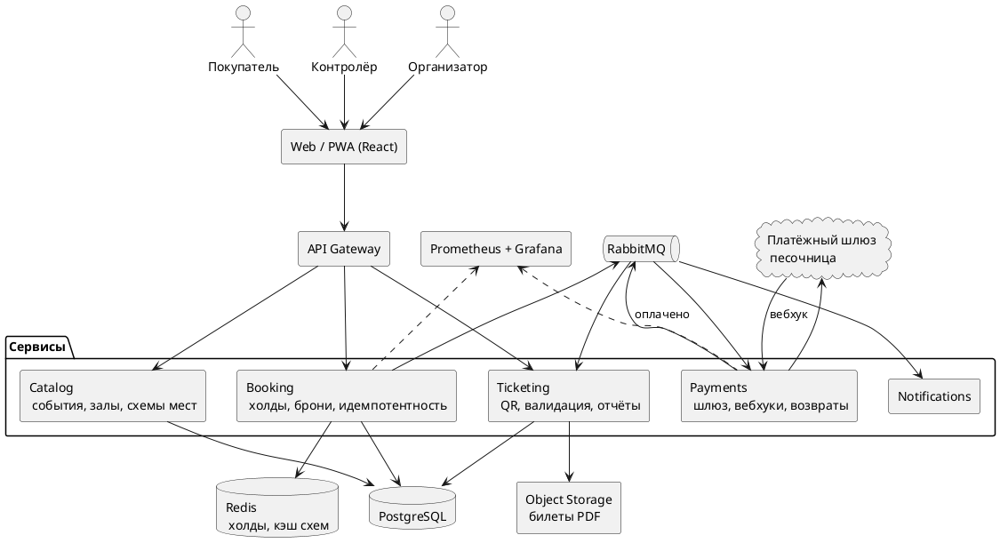

# Дипломный проект: билетная платформа для мероприятий

Sep 24, 2026 · @ami

Тема рабочая при одном условии: на защите продаётся не «сайт продажи билетов», а инженерное ядро (конкурентное бронирование под нагрузкой) плюс бизнес-модель ниши, где нет прямого столкновения с Freedom Ticketon.

## Паспорт проекта

Продукт — SaaS для организаторов мероприятий: организатор сам заводит событие, схему зала и продаёт билеты со своего сайта и соцсетей, без выхода на чужую витрину.

**Проблема.** Билетные операторы в Казахстане берут с организатора комиссию 8–10%. Организаторам, которые приводят аудиторию сами (конференции, стендап, лекции, локальные фестивали, спортклубы), витрина оператора не нужна, а комиссию они платят полную.

**Почему не маркетплейс.** Freedom Ticketon работает с 2012 года, продал около 20 млн билетов, сотрудничает с более чем 3000 партнёров и покрывает свыше 43% кинотеатров и более 87% театров страны. Конкурировать витриной бессмысленно, и комиссия это увидит первой.

**Целевой пользователь:** организатор мероприятия на 100–3000 мест, 2–20 событий в год.

**Что защищаем на комиссии — три вещи:**

1. Инженерное ядро: корректность продажи мест при конкурентном доступе, подтверждённая нагрузочным экспериментом.
2. Архитектуру, которая масштабируется под всплеск продаж в момент старта.
3. Бизнес-модель с посчитанной юнит-экономикой, а не с процентами «на глаз».

## Объём MVP

Объём рассчитан на одного разработчика за учебный год. Всё, что не входит в MVP, идёт в раздел «развитие продукта» и на защите звучит как осознанно отрезанное.

| Блок | Входит в MVP | Отрезано |
| --- | --- | --- |
| Событие | Создание, категории цен, публикация страницы | Мультиязычность, промо-страницы |
| Зал | Схема мест из редактора, безместные секции | Импорт схем из чужих форматов |
| Покупка | Холд места на 10 минут, оплата, автоотмена просрочки | Продажа абонементов, рассадка группами |
| Оплата | Интеграция с песочницей платёжного шлюза, идемпотентные вебхуки | Сплит-платежи между организаторами |
| Билет | QR с подписью, PDF, отправка на почту | Apple/Google Wallet |
| Контроль входа | PWA-сканер с офлайн-режимом и синхронизацией | Турникеты, аппаратные сканеры |
| Возвраты | Полный и частичный возврат со статусной моделью | Перепродажа между покупателями |
| Кабинет организатора | Продажи, заполняемость, выгрузка отчёта | Маркетинговая аналитика, рассылки |
| Защита продаж | Лимит билетов на аккаунт и IP, очередь ожидания при старте | Полноценный антифрод, скоринг |

Офлайн-режим сканера — не украшение: контролёр на входе часто стоит в фойе или подвале без связи, и это реальный сценарий для защиты.

## Архитектура

Сервисы разделены по границам нагрузки: каталог читают все и постоянно, бронирование пишет и конфликтует, оплата ждёт внешний шлюз. Связь между ними асинхронная, через очередь, поэтому подвисание шлюза не роняет продажу.



**Ключевые решения и их обоснование:**

| Решение | Зачем |
| --- | --- |
| Холды мест в Redis с TTL | Место освобождается само, без планировщика и без блокировок в БД |
| Истина о брони в PostgreSQL | Redis может потерять данные, деньги — нет |
| Идемпотентность по ключу запроса | Повтор вебхука или ретрай клиента не создаёт вторую бронь и вторую оплату |
| Очередь между оплатой и выпуском билета | Шлюз отвечает медленно и иногда дважды; выпуск билета не должен ждать HTTP |
| Статусная модель заказа | Возвраты и отмены разбираются по переходам, а не по флагам |
| Схема зала кэшируется целиком | Чтение схемы — самый частый запрос, он не должен ходить в БД |

**Стек:** Go (chi, pgx, sqlc, goose), PostgreSQL, Redis, RabbitMQ, React с TypeScript, Docker Compose, k6, Prometheus и Grafana. Реализация — модульный монолит: один бинарь API плюс воркер, границы пакетов повторяют сервисы на схеме и при необходимости выносятся отдельно.

## Покупатель и организатор

- **Покупатель входит по номеру телефона и SMS-коду**, без пароля и регистрации. Номер — это идентичность покупателя для лимитов и восстановления билетов. Email спрашивается при покупке только для доставки PDF-билета. Покупатель общий для всех организаторов.
- **Организатор — отдельный арендатор.** Все его данные (залы, события, заказы, билеты) изолированы от других организаторов.
- **Организатора заводит администратор платформы** через админку после заключения договора. Самостоятельная регистрация не входит в MVP: она требует проверки организатора и модерации событий. Создание организатора сделано отдельной операцией, чтобы позже подключить к ней форму регистрации.
- **У организатора один вход** (владелец). Контролёры на входе не получают учётных записей: организатор создаёт ссылку сканера для конкретного события, она даёт только право сканировать билеты этого события и может быть отозвана.
- **Секции без мест** продаются как виртуальные места: секция на 500 человек — это 500 мест без ряда. Для механики продажи они ничем не отличаются от мест с рядом.

## Статусные модели

### Заказ

```
pending ──► paid ──► partially_refunded ──► refunded
   │          └──────────────────────────────► refunded
   ├──► expired
   └──► cancelled
```

| Статус | Смысл |
|---|---|
| `pending` | заказ создан, места удерживаются 10 минут, ждём оплату |
| `paid` | оплачен, билеты выпущены |
| `expired` | 10 минут прошли без оплаты, места свободны |
| `cancelled` | покупатель отменил до оплаты |
| `partially_refunded` | часть билетов возвращена |
| `refunded` | возвращены все билеты |

`expired`, `cancelled` и `refunded` — конечные статусы.

**Оплата после истечения удержания.** Если подтверждение оплаты пришло, когда заказ уже `expired`, заказ не восстанавливается: место могли купить. Платёж автоматически возвращается полностью.

### Платёж

`created → pending → succeeded | failed`. У заказа может быть несколько попыток оплаты, успешной — только одна. Повторное уведомление от шлюза ничего не меняет.

### Возврат

`requested → pending → succeeded | failed`. Возврат относится к конкретным билетам. Сумма успешных возвратов не больше суммы платежа. Статус заказа меняется только после успешного возврата.

### Билет

`issued → used`, `issued → revoked`. Использованный билет не возвращается. Если офлайн-сканеры пропустили билет дважды, при синхронизации засчитывается первое сканирование, второе фиксируется как повторная попытка прохода.

### Правила отмены и возврата (подтверждено 2026-09-28)

| Вопрос | Решение |
|---|---|
| Кто может отменить неоплаченный заказ | только покупатель; неоплаченный заказ и так истекает через 10 минут |
| До какого момента можно вернуть билет | срок задаёт организатор для события; по умолчанию — не позже чем за 24 часа до начала |
| Отмена события организатором | входит в MVP: все оплаченные заказы возвращаются полностью |

## Инженерное ядро

Научно-практическая часть работы — сравнение трёх стратегий захвата места при конкурентном доступе. Это то, что отличает диплом от «я сделал сайт»: есть гипотеза, эксперимент и измеримый результат.

**Сценарий эксперимента.** N виртуальных пользователей одновременно пытаются купить одно и то же место в момент старта продаж. Прогон в k6 на 500, 2000 и 5000 одновременных запросов, по три повтора на каждую стратегию.

| Стратегия | Механизм | Гипотеза |
| --- | --- | --- |
| Пессимистичная блокировка | SELECT FOR UPDATE по строке места | Корректно, но растёт время ожидания и БД становится узким местом |
| Оптимистичная блокировка | Версия строки, повтор при конфликте | Быстрее на низкой конкуренции, много откатов на высокой |
| Очередь на Redis | Атомарный захват ключа места с TTL | Стабильная задержка, но нужен разбор рассинхрона с БД |

**Что измеряем:**

- число двойных броней (целевое значение — ноль во всех прогонах);
- p95 и p99 времени ответа на попытку захвата;
- пропускная способность, успешных захватов в секунду;
- доля откатов и повторов;
- поведение при отказе Redis в середине прогона.

**Результат для защиты:** таблица и графики по трём стратегиям с обоснованием, какая ушла в продукт и почему. Плюс отдельный прогон на корректность: суммарно продано ровно столько билетов, сколько мест, при любом уровне нагрузки.

## Бизнес-модель

Главный вывод расчёта: на комиссионной модели маржа с билета тонкая, поэтому базовой делаем подписку, а процент оставляем как дополнение.

**Рынок, считаем снизу вверх.** Число организаторов в сегменте × события в год × средняя посадка × средний чек × комиссия. Для проверки порядка величин есть публичный ориентир: выручка Ticketon за 2021 год оценивалась в 6,1 млн долларов при среднем чеке 11,9 доллара и примерно 42 810 онлайн-заказах в месяц.

**Три сценария монетизации:**

| Модель | Кто платит | Ставка | Когда выигрывает |
| --- | --- | --- | --- |
| Сервисный сбор | Покупатель | 5% сверху билета | Массовые события, организатор ничего не платит |
| Подписка | Организатор | Фиксированная плата в месяц | Регулярные события, предсказуемая выручка |
| Гибрид | Оба | Подписка + 1% с билета | Базовый сценарий для финмодели |

**Юнит-экономика на один билет (допущения, не факты).** Билет 8 000 ₸, сервисный сбор 5%:

| Статья | Сумма |
| --- | --- |
| Выручка с билета | 400 ₸ |
| Эквайринг, около 2,5% от 8 400 ₸ | −210 ₸ |
| Инфраструктура и уведомления | −20 ₸ |
| Валовая маржа | 170 ₸, около 2% от стоимости билета |

Отсюда стратегический вывод для защиты: чистая комиссионная модель требует объёма, которого у новичка нет, поэтому деньги делает подписка, а процент покрывает переменные издержки.

**Финплан на три года** считаем в отдельной модели: выручка по двум потокам, постоянные и переменные расходы, точка безубыточности, CAC и LTV, сценарии пессимистичный, базовый и оптимистичный.

**Выход на рынок.** Первые клиенты — 20–50 организаторов конференций, стендапа и локальных фестивалей, через прямые продажи и бесплатный первый ивент.

## План работ

| Период | Результат |
| --- | --- |
| Октябрь | Утверждение темы, анализ рынка и конкурентов, техническое задание |
| Ноябрь | Архитектура, модель данных, спецификация API, макеты |
| Декабрь | Каталог событий, редактор схемы зала, кабинет организатора |
| Январь | Бронирование и холды, три стратегии захвата места |
| Февраль | Оплата через песочницу шлюза, вебхуки, возвраты |
| Март | QR-билеты, PWA-сканер с офлайн-режимом, отчёты |
| Апрель | Нагрузочные эксперименты, финмодель, сбор результатов |
| Май | Пояснительная записка, презентация, репетиция защиты |

Правило по срокам: если к концу января бронирование не работает под нагрузкой, режем функциональность из колонки «отрезано», а не сдвигаем эксперимент.

## Риски

| Риск | Как закрываем |
| --- | --- |
| «Это просто интернет-магазин билетов» — главный риск темы | Вся защита строится вокруг эксперимента с конкурентным бронированием и графиков нагрузки, а не вокруг интерфейса |
| Объём не влезает в год | Жёсткая граница MVP, функциональность режется по заранее написанному списку |
| Нет реального платёжного шлюза | Работаем только с публичной песочницей и публичными тарифами, без внутренних данных работодателя |
| Вопрос комиссии «а зачем, если есть Ticketon» | Ответ подготовлен заранее: другая модель, другой сегмент, другая экономика |
| Нет реальных клиентов | Заранее собрать 3–5 интервью с организаторами и вынести цитаты в записку |
| Написано не самостоятельно | Каждое архитектурное решение должно быть объяснимо вслух, без опоры на текст |

## Источники

- [Ticketon: о компании](https://ticketon.kz/cms/about) — около 20 млн проданных билетов, более 3000 партнёров, вхождение в Freedom Holding в 2022 году
- [Тикетон в Википедии](https://ru.wikipedia.org/wiki/Тикетон) — покрытие более 43% кинотеатров и более 87% театров Казахстана
- [Kapital.kz, как продавать билеты на своё мероприятие](https://kapital.kz/business/71075/kak-prodavat-bilety-na-svoye-meropriyatiye.html) — комиссия билетных операторов 8–10% по Казахстану, конкурент Eventum.one
- [Business FM Kazakhstan](https://businessfm.kz/business/pokupka-ticketon-oboshlas-freedom-v-dollar3-mln) — выручка Ticketon за 2021 год, средний чек, число заказов в месяц

Цифры юнит-экономики в разделе «Бизнес-модель» — собственные допущения, не данные из источников.
