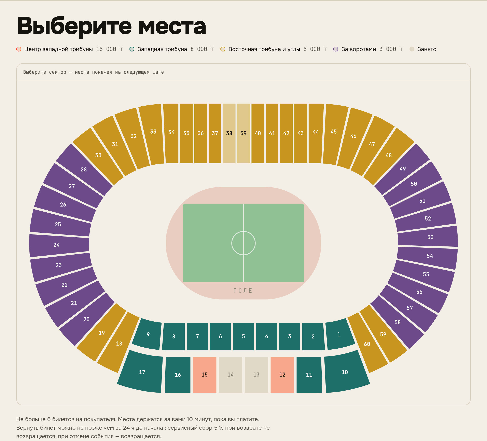
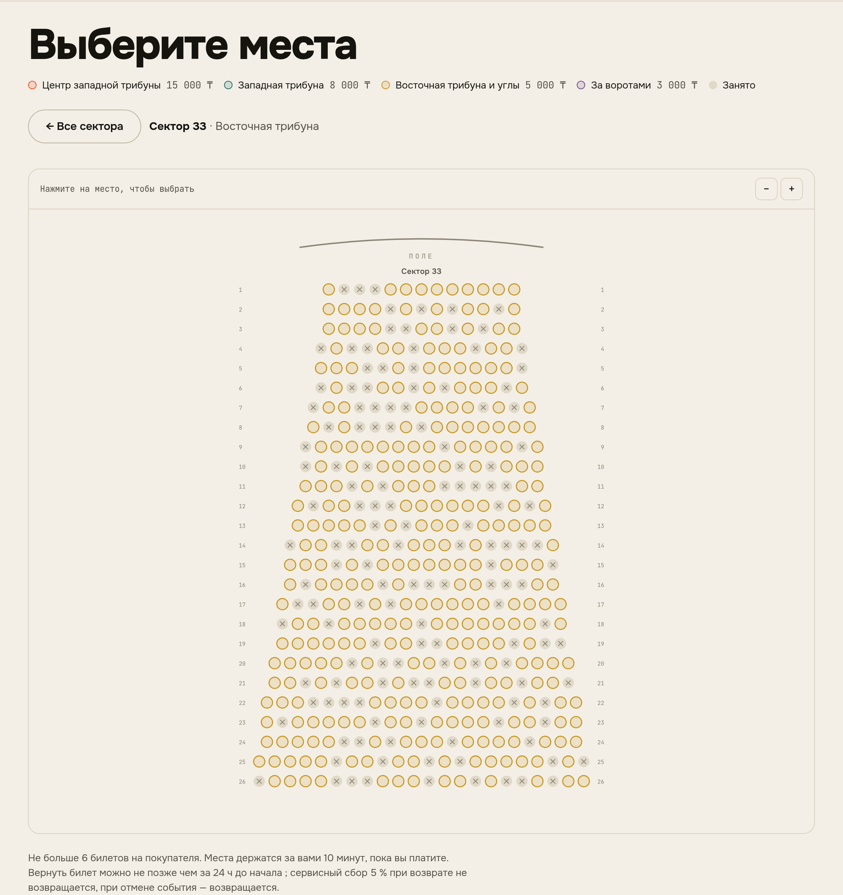
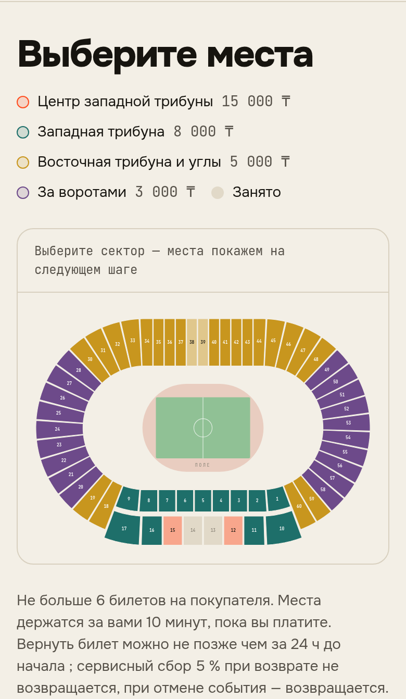

# Центральный стадион Алматы

Первый шаблон большой площадки (ADR 024). Организатор добавляет его в кабинете: «Площадки» → «Готовые схемы площадок» → «Добавить со схемой». Площадка и схема заводятся в один шаг.

## Что взято из открытых источников

| | |
|---|---|
| Вместимость | 23 804 места |
| Трибуны | западная (главная), северная и южная за воротами, восточная |
| Сектора | западная 1–17, северная 18–28, восточная 30–48, южная 49–60; сектора 29 нет |
| Центр западной трибуны | сектора 12–15 |
| Угловые сектора у западной трибуны | 18–19 и 59–60 |
| Входы | западная и северная — с проспекта Абая, восточная — с улицы Байтурсынова, южная — с улицы Сатпаева |

Источники: справка о стадионе (tengrinews.kz, ticketon.kz), ценовые категории и порядок входа на матчи «Кайрата» в 2025 году (fckairat.com, vesti.kz, legalbet.kz).

## Что приближённо

- **Геометрия чаши.** Схематическая: кольцо вокруг поля с беговой дорожкой, прямые западная и восточная трибуны, закруглённые северная и южная. Доли кольца: западная 26%, восточная 34%, северная и южная по 20%.
- **Ярусы западной трибуны.** Два яруса: нижний — сектора 1–9, верхний — 10–17. Так нумерация сходится с центром трибуны в секторах 12–15.
- **Ряды и места.** Рядов — 14 и 18 у ярусов западной трибуны, 26 у остальных трибун. Мест в ряду — по длине ряда. Шаг места подобран так, чтобы сумма точно совпала с вместимостью.
- **Цены.** Пример деления на категории: центр запада, запад, восток с углами, за воротами. На реальных матчах внутри секторов 1–9 первые три ряда стоят дешевле. Цена в системе задаётся на сектор целиком, поэтому такое деление шаблон не повторяет.

Перед реальной продажей ряды сверяются со схемой владельца площадки.

## Как выглядит

План: цвет — ценовая категория. Бледный сектор — мест почти нет, серый — распродан.



Сектор открывается кликом, места рисуются только в нём:



На телефоне план вписывается в ширину экрана:



Повторить локально:

```sh
go run ./cmd/loadseed stadium -out stadium.json   # путь события — в поле path
```
