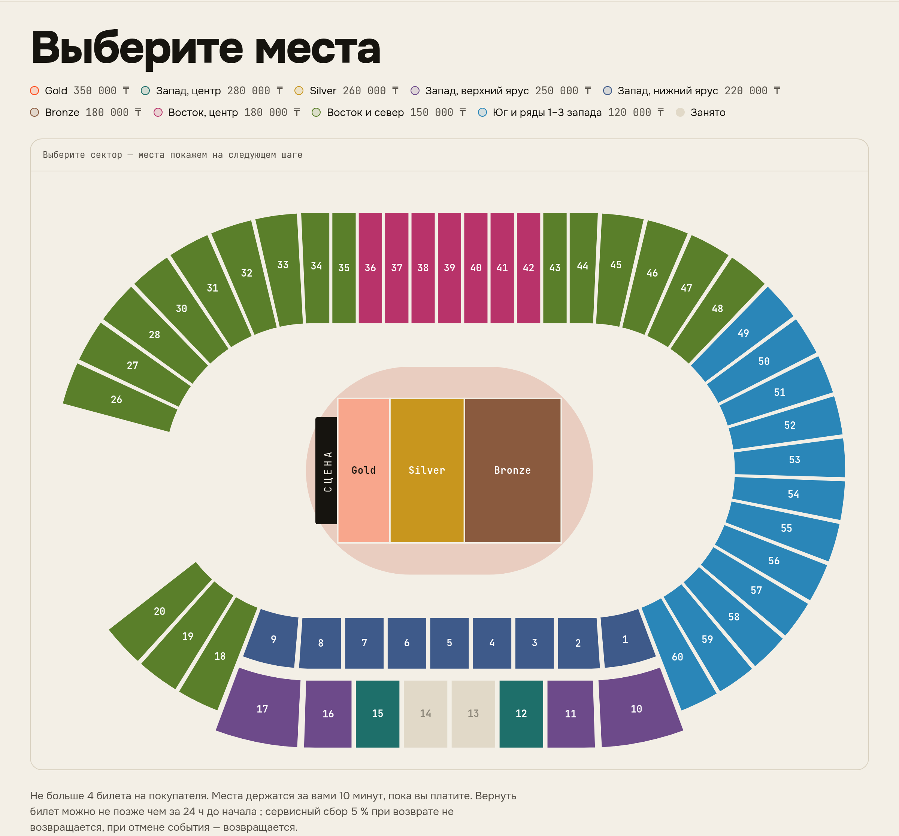
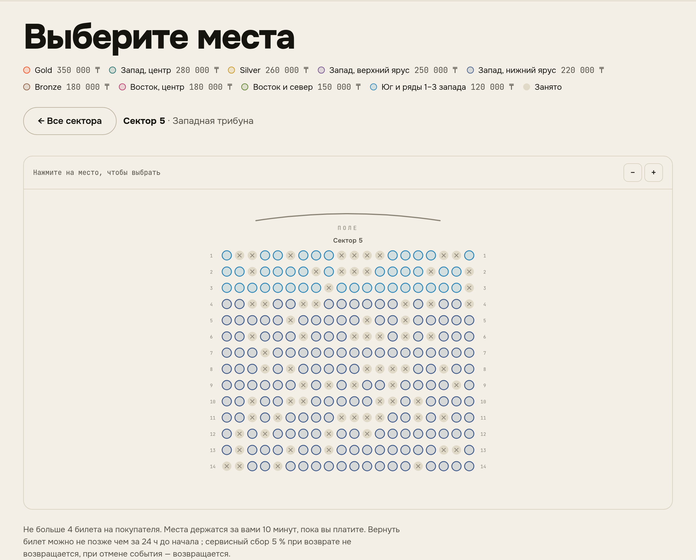
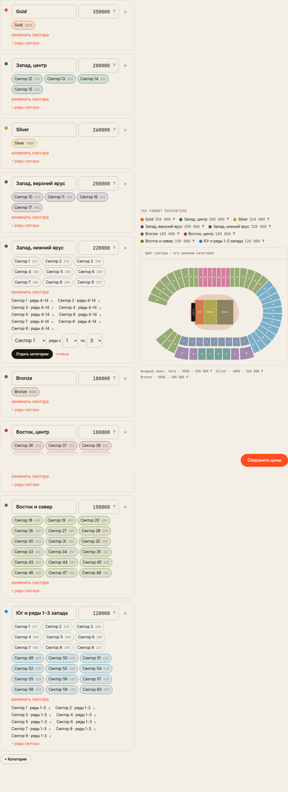

# Центральный стадион Алматы

Первый шаблон большой площадки (ADR 024). Организатор добавляет его в кабинете: «Площадки» → «Готовые схемы площадок» → «Добавить со схемой». Площадка и схема заводятся в один шаг.

Шаблонов два:
- **Футбол.** 59 секторов, 23 804 места.
- **Концерт со сценой у северной трибуны** (ADR 025). Сделан по образцу концерта Ye в августе 2026: фан-зоны на поле, сектора 21–25 за сценой закрыты.

## Что взято из открытых источников

| | |
|---|---|
| Вместимость | 23 804 места |
| Трибуны | западная (главная), северная и южная за воротами, восточная |
| Сектора | западная 1–17, северная 18–28, восточная 30–48, южная 49–60; сектора 29 нет |
| Центр западной трибуны | сектора 12–15 |
| Угловые сектора у западной трибуны | 18–19 и 59–60 |
| Входы | западная и северная — с проспекта Абая, восточная — с улицы Байтурсынова, южная — с улицы Сатпаева |

Источники: справка о стадионе (tengrinews.kz, ticketon.kz), ценовые категории и порядок входа на матчи «Кайрата» в 2025 году (fckairat.com, vesti.kz, legalbet.kz). Концерт Ye: kommersant.ru, informburo.kz, astanatimes.com, новости о ценах (liter.kz, weproject.media), схема входов (bes.media, caravan.kz).

## Что приближённо

- **Геометрия чаши.** Схематическая: кольцо вокруг поля с беговой дорожкой, прямые западная и восточная трибуны, закруглённые северная и южная. Доли кольца: западная 26%, восточная 34%, северная и южная по 20%.
- **Ярусы западной трибуны.** Два яруса: нижний — сектора 1–9, верхний — 10–17. Так нумерация сходится с центром трибуны в секторах 12–15.
- **Ряды и места.** Рядов — 14 и 18 у ярусов западной трибуны, 26 у остальных трибун. Мест в ряду — по длине ряда. Шаг места подобран так, чтобы сумма точно совпала с вместимостью.
- **Цены футбола.** Пример деления на категории: центр запада, запад, восток с углами, за воротами. Первые три ряда секторов 1–9 у беговой дорожки — в самой дешёвой категории, как на матчах «Кайрата» (цена по рядам, ADR 025).

Перед реальной продажей ряды сверяются со схемой владельца площадки.

## Как выглядит

План: цвет — ценовая категория. Бледный сектор — мест почти нет, серый — распродан.


Сектор открывается кликом, места рисуются только в нём:


На телефоне план вписывается в ширину экрана:


## Концерт

Образец — концерт Ye (Kanye West) на Центральном стадионе 14–15 августа 2026.

**Из открытых источников:**
- категории на поле: Gold — 350 000 ₸, Silver — 260 000 ₸, Bronze — 180 000 ₸;
- цены на трибунах: 280, 250, 220, 180, 150 и 120 тысяч тенге;
- не больше четырёх билетов в одни руки;
- вход Bronze — со стороны улицы Сатпаева.

**Наша раскладка** (источники её не публиковали):
- **Сцена** — на поле у северной трибуны. Сектора 21–25 за ней не продаются.
- **Фан-зоны на поле** — от сцены: Gold на 3 000, Silver на 4 000, Bronze на 5 000 человек. Вместимость приближённая.
- **Цены трибун:**

| Категория | Цена | Сектора |
|---|---:|---|
| Запад, центр | 280 000 ₸ | 12–15 |
| Запад, верхний ярус | 250 000 ₸ | 10–11, 16–17 |
| Запад, нижний ярус | 220 000 ₸ | 1–9, ряды 4–14 |
| Восток, центр | 180 000 ₸ | 36–42 |
| Восток и север | 150 000 ₸ | 18–20, 26–28, 30–35, 43–48 |
| Юг и ряды 1–3 запада | 120 000 ₸ | 49–60; 1–9, ряды 1–3 |



Сектор нижнего яруса: первые три ряда — другого цвета и дешевле.



Редактор цен в кабинете. Категория получает сектора целиком и ряды внутри сектора. Поделённый сектор обведён пунктиром.



## Повторить локально

```sh
go run ./cmd/loadseed stadium -out stadium.json                      # футбол
go run ./cmd/loadseed stadium -template concert -out concert.json    # концерт
```

Путь события — в поле `path` выходного файла.
